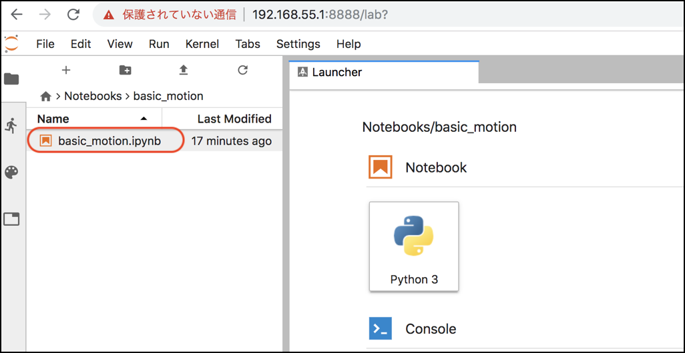
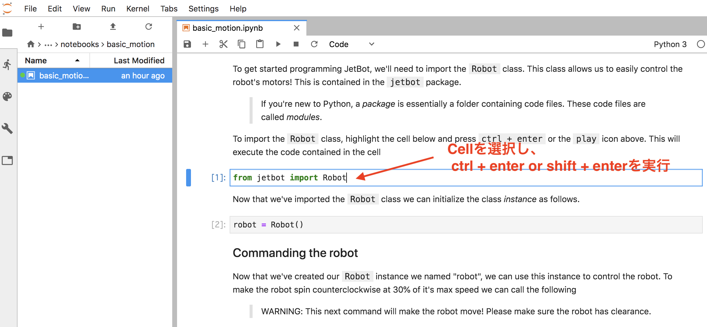
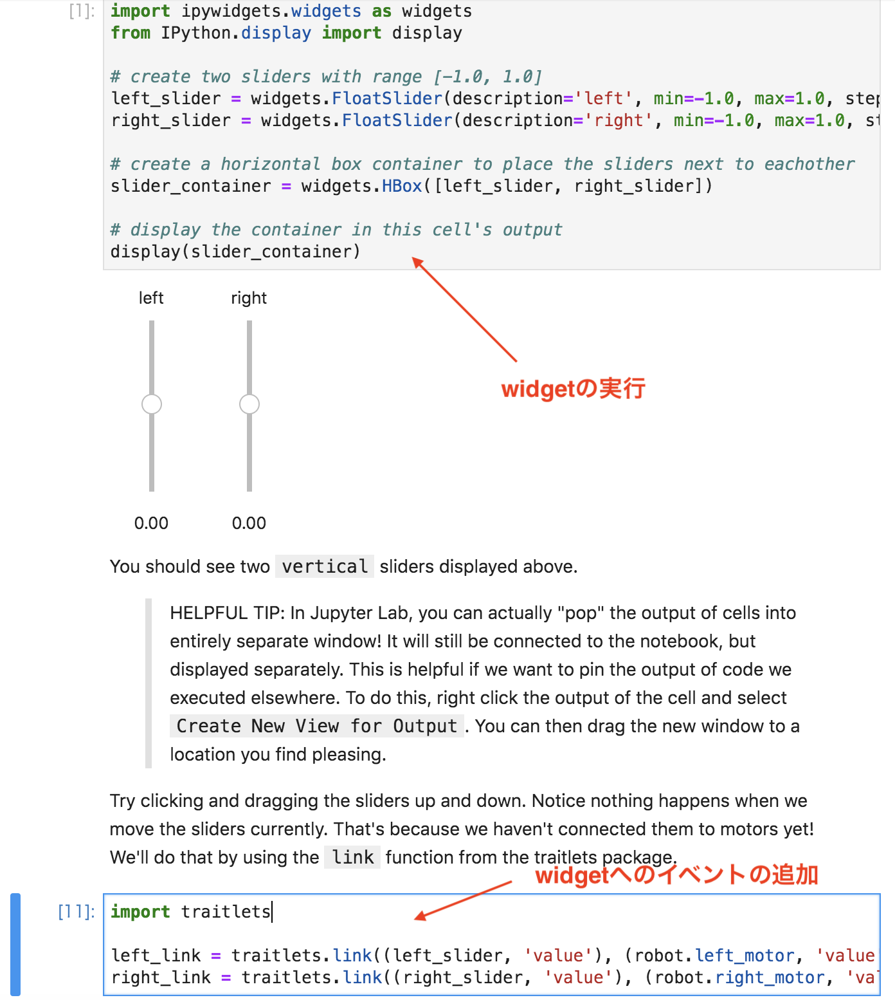
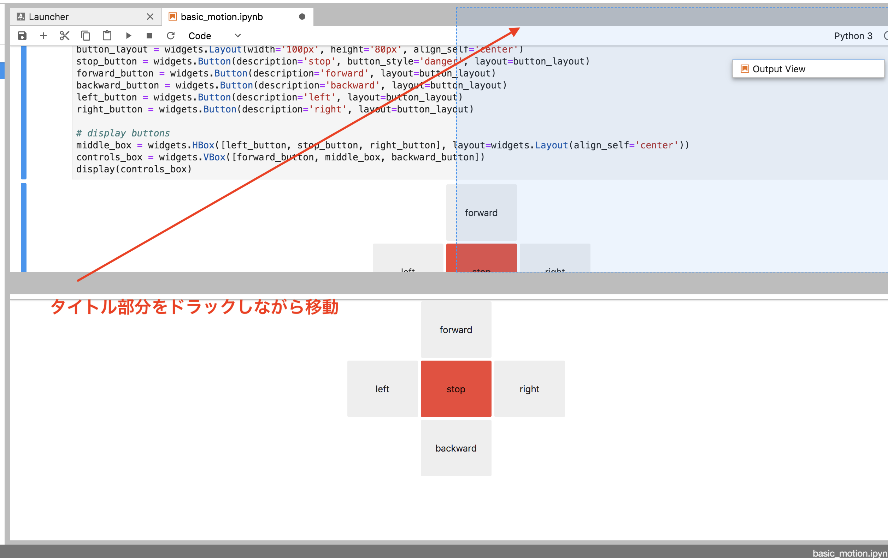
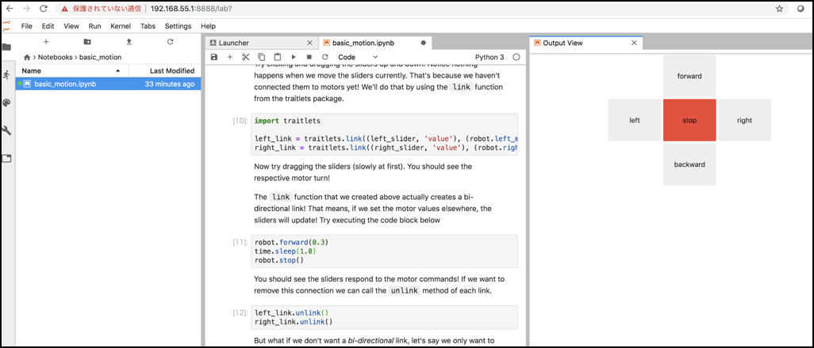

# Basic motionの実行

JetBotのIPアドレスに8888版ポートで接続します。

|接続方法|接続先|
|:--|:--|
|USB|http://192.168.1.55:8888|
|Wifi|http://割り振られたIPアドレス:8888|

!!! Tip
	Jupyterのpasswordは`jetbot`です。

## Notebookを開く

`/Notebooks/basic_motion/basic_motion.ipynb` を開きます。

## Notebookの実行

Jupyterで上から順番にCellを実行していきます。

Widgetは、Widgetの表示と、イベントの対応付けで処理が別れているので、Widgetが表示された後で、イベント処理と対応付けを実行する事で、Widgetの操作でJetBotが操作できるようになります。

## Control用のViewの取り出し

Widgetで実行したController部分は、Viewとして別のWindowに切り分ける事が可能です。

