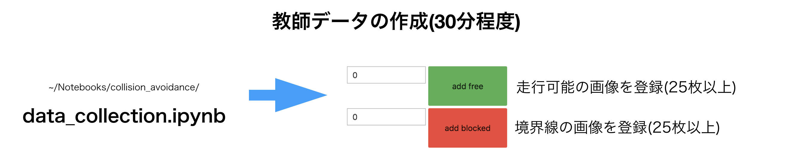
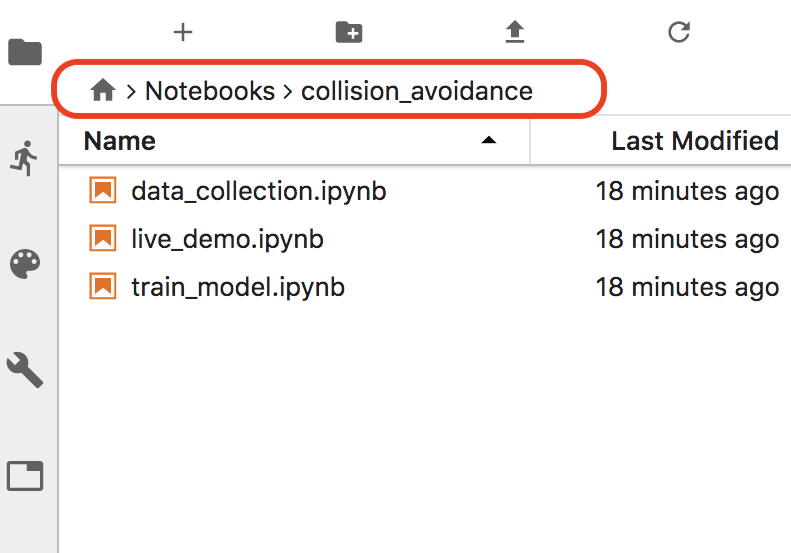
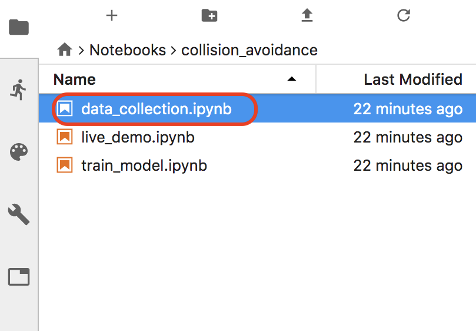
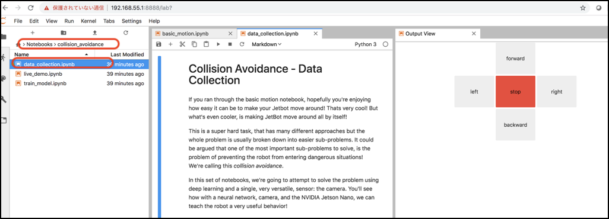
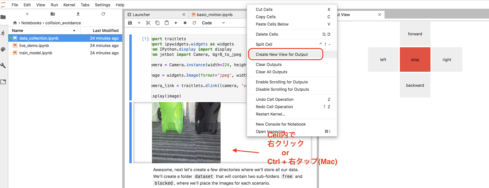

# Datasetの作成

障害物を避けるための50枚+50枚程度(合計 100枚)のデータ・セットを作成し、学習させます。

!!!Warning "必要なデータセットの数"
	それぞれ50枚で、合計100枚が最低必要枚数です。50枚 x 2 以下の場合はエラーがでます。

## Notebook

Jupyter上で、~/Notebooks/collision_avoidanceを開きます。

|Notebook|用途|
|:--|:--|
|data_collecion.ipynb|データ・セット作成用|
|live_demo.ipynb|実行用|
|train_model.ipynb|トレーニング用|

## データ・セットの作成

data_collecion.ipynbを開きます。

カメラを起動します。

Jupyterを実行していくと、datasetフォルダが生成され、フォルダ下に画像が保存されていきます。

障害物の時はadd blocked, 開放エリアの時はadd freeで写真を登録していきます。

!!! Warning
	Chromeのタブをたくさん開いていると、Jupyter用のメモリが不足する可能性があるので、タブは閉じて作業をおこなうとよい

