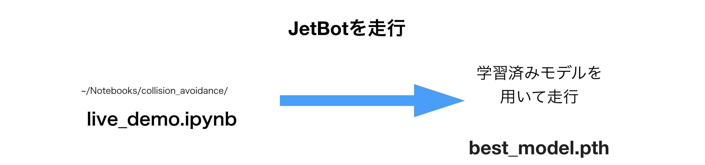
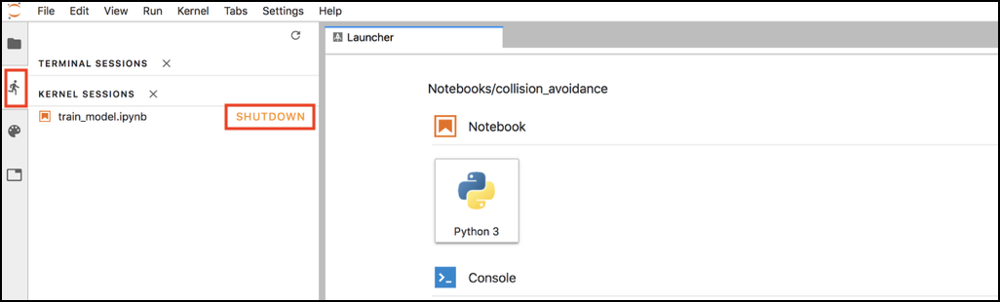

# JetBotでの実行

## 学習済みモデル

Jetsonでのローカルでの学習から、学習済みモデルであるbest_model.pthが同じフォルダに、生成されています。

## プロセスのシャットダウン

実行時メモリが足りなくなるので、前回までのサンプルを終了します。

## Live demoの実行

Jupyter上で、~/Notebooks/collision_avoidance/live_demoを開きます。

