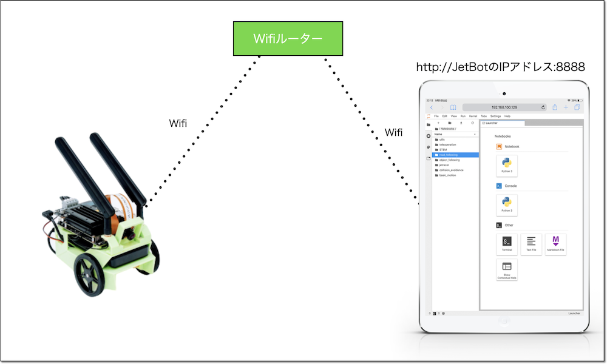
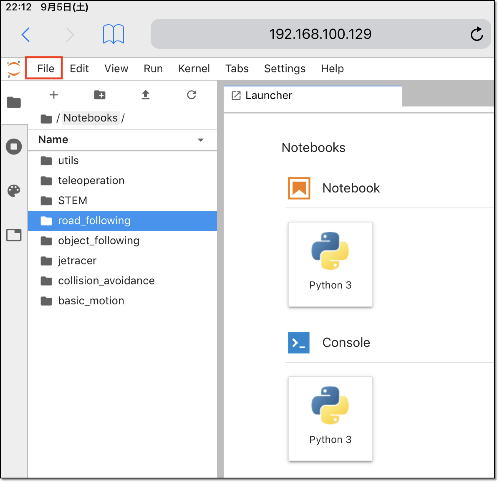
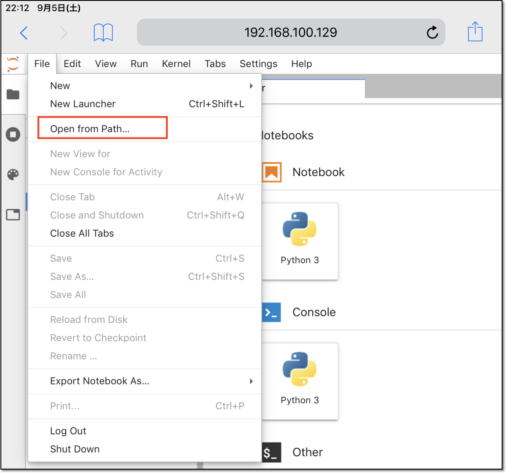
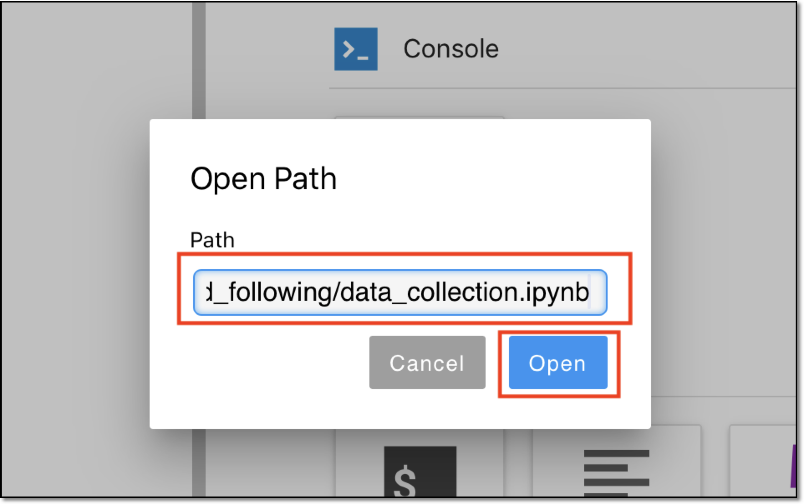

# 1.対応端末

## 対応OSと必要条件

|OS|必要条件|
|:--|:--|
|Windows|ブラウザはChromeを使用する|
|Mac|ブラウザはChromeを使用する|
|iPad|一部制限はあるが下記方法で実行可能|

## iPad

研修でiPadを使用する場合は、WiFiをルーター経由し、JetBotとiPadをWiFiで接続する。

Jupyterの画面のTop画面が表示され、最初にパスワードを聞かれるので、``jetbot``と入力する。

|Jupyterのパスワード|
|:--|
|jetbot|

Jupyterのメニューから\[File\]を選択する。

Jupyterのメニューから\[Open from Path...\]を選択する。

Pathには、各教材毎に下記パスを入力する。

|項目|URL|iPadからの動作|
|:--|:--|:--|
|Collision Avoidance|/Notebooks/collision_avoidance/01_data_collection_JP.ipynb|○|
|Road Following|/Notebooks/road_following/01_data_collection_JP.ipynb|○|

