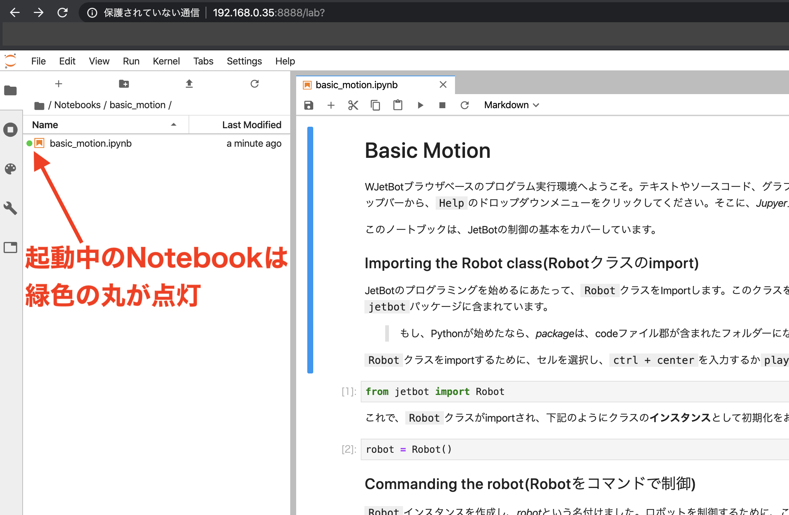
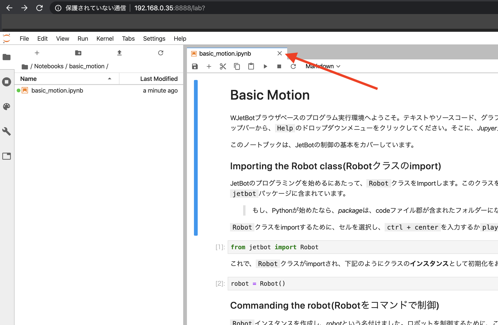
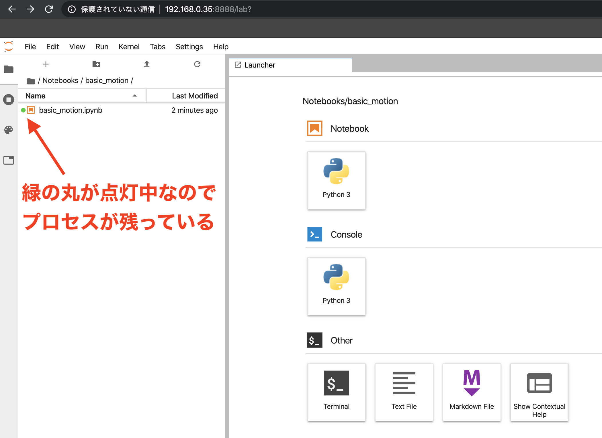
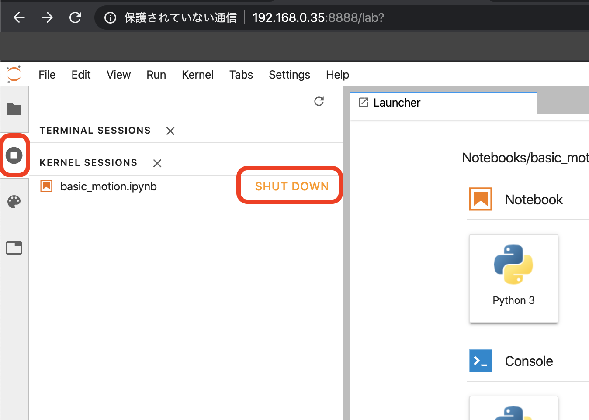

# 4.Jupyterの注意事項

## Jupyterのメモリ管理

Jupyterでは、開かれたNotebookは、プロセスとして常駐します。プロセスをKillする場合は、Shutdownの処理を必ず実行します。(Linuxの再起動時でも、Killしないプロセスは再び常駐します)

Notebookは、同時に1つ以上起動しないようにしてください。メモリ不足に至る可能性があります。

## JupyterのプロセスをKillする

Notebookを閉じます。

緑色の丸が点灯しているのでプロセス自体は残っています。

プロセスをShutdownします。

この状態で初めてメモリが開放されます。
