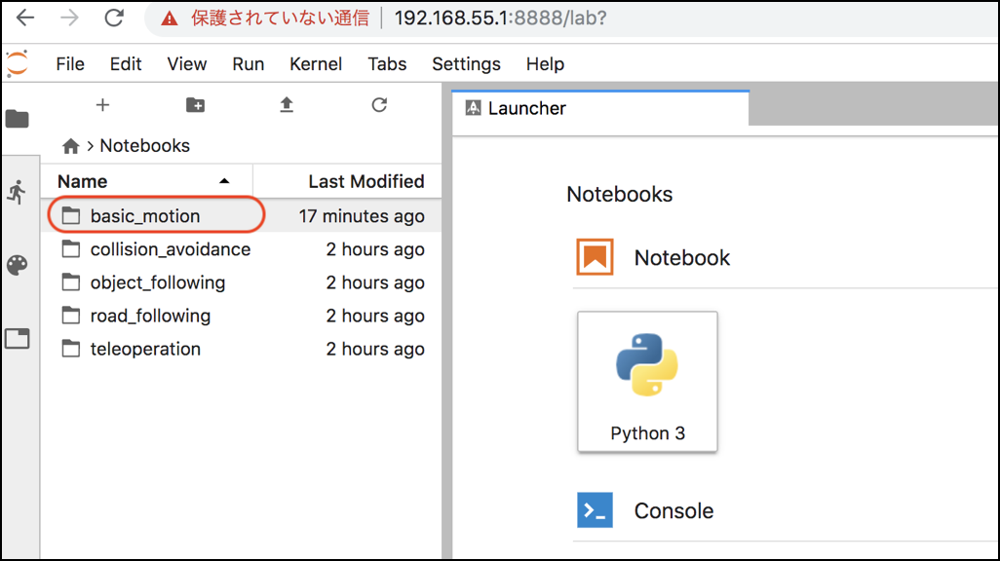
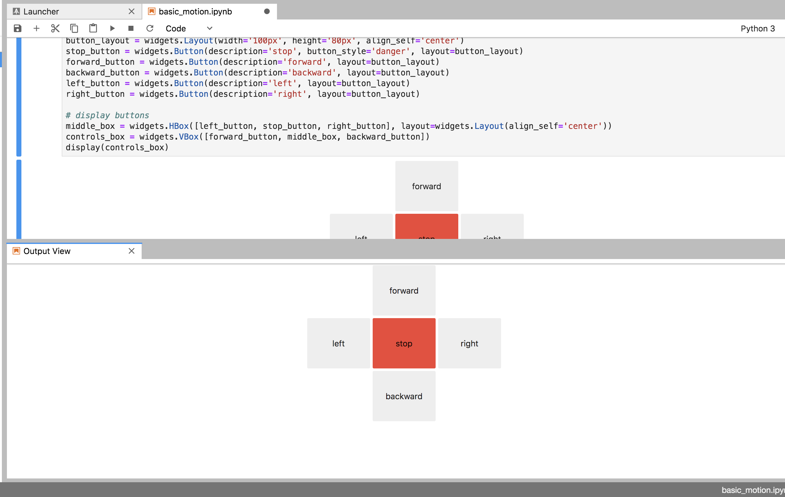

# Basic motionの実行

PCのブラウザでJetBotのIPアドレスの8888ポートに接続します。  
`http://192.168.xxx.xxx:8888`

!!! Tip
	Jupyterのpasswordは`jetbot`です。  

## Notebookを開く

`/Notebooks/basic_motion/01_basic_motion_JP.ipynb` を開きます。

## Notebookの実行

Jupyterで上から順番にCellを実行していきます。

Widgetは見た目の作成と、イベントの対応付けで機能します。  
先にWidgetを表示してからイベント処理を対応付けることで、Widgetの操作でJetBotが動作するようになります。

## Control用のViewの取り出し

Jupyterの機能を使うことで、Widgetで作成したController部分を、別のWindowに表示する事が可能です。

