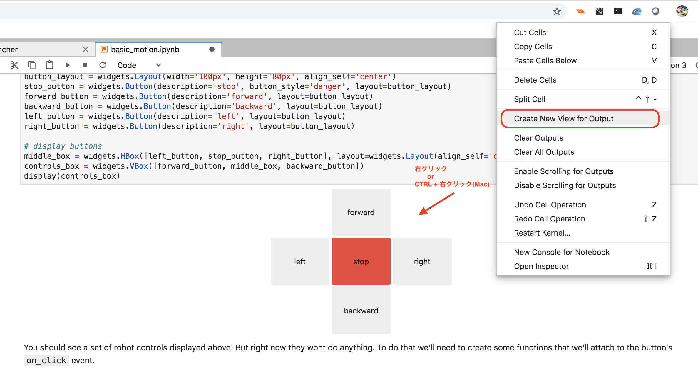

# Basic motionの実行

PCのブラウザでJetBotのIPアドレスの8888ポートに接続します。  
`http://192.168.xxx.xxx:8888`

!!! Tip
	Jupyterのpasswordは`jetbot`です。  

## Notebookを開く

`/Notebooks/basic_motion/01_basic_motion_JP.ipynb` を開きます。


## Notebookの実行

Jupyterで上から順番にCellを実行していきます。


Widgetは見た目の作成と、イベントの対応付けで機能します。  
先にWidgetを表示してからイベント処理を対応付けることで、Widgetの操作でJetBotが動作するようになります。


## Control用のViewの取り出し

Jupyterの機能を使うことで、Widgetで作成したController部分を、別のWindowに表示する事が可能です。




## Build Recommendedのポップアップが表示されるとき

Jupyterプラグインが未ビルドの時に、次のようなポップアップが表示されます。  
```
JupyterLab build is suggested:
jupyter_clickable_image_widget content changed
```

このとき、ブラウザからはビルドができないので、CancelでOKです。


Buildを選択しても、ビルドに失敗します。（悪影響はありません）


このポップアップを解決したい場合は、ターミナルでroot権限でコマンドを実行します。  
Jupyterのターミナルから実行することも可能です。Docker版でsudoコマンドがない場合は、すでにroot権限のターミナルとなっているので、コマンドラインで`jupyter lab build`を実行してください。
```
sudo jupyter lab build
```


このポップアップは特定のJupyterプラグインをインストール後に初めてJupyterにアクセスした時に表示されます。  
放置しても問題ありませんが、わずらわしい場合は上記のように解決することができます。


