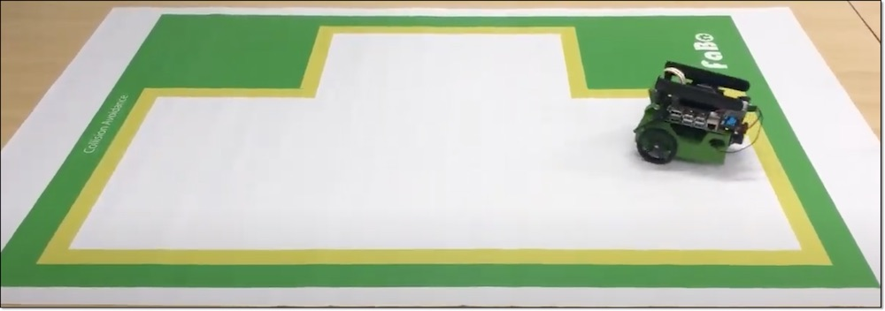
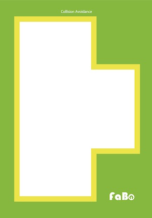
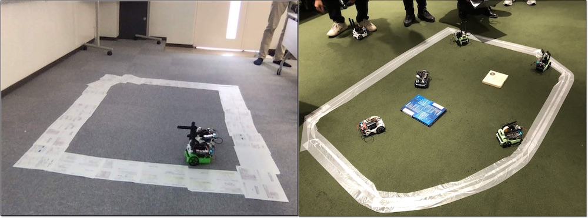

# 1.学習のススメ方

Collision Avoidanceでは、指定区域の走行や障害物回避の学習をさせることが可能です。

## 学習のススメ方

1,2,3の順で実行します。各項目が終わったらNotebookのShutdownを忘れないようにしてください。

|項目|Notebook|操作|写真|
|:--|:--|:--|:--|
|1.データ収集|data_collection.ipynb|Jetbotを使ってデータを収集||
|2.学習|train_model.ipynb|転移学習で収集したデータを学習||
|3.デモ走行|live_demo.ipynb|学習結果でデモ走行||

## コース

コースは、集団研修では、FaBo製の``Collision Avoidance``コースの利用をお勧めします。

コースが準備できない場合は、下記例のような境界線を明確にしたエリアを作成してください。

## デモ走行　

