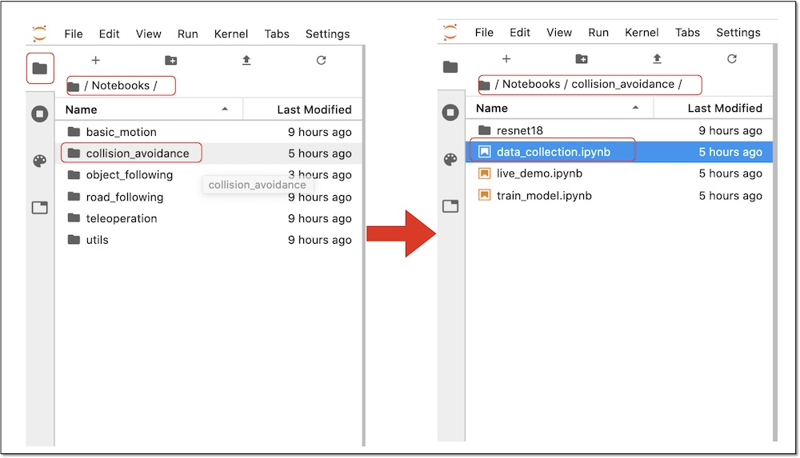
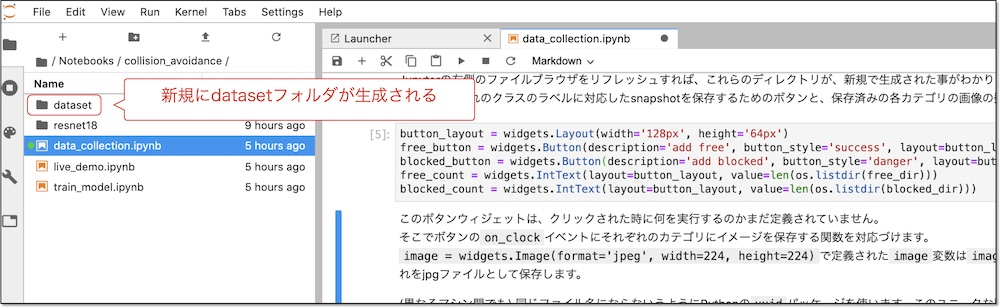
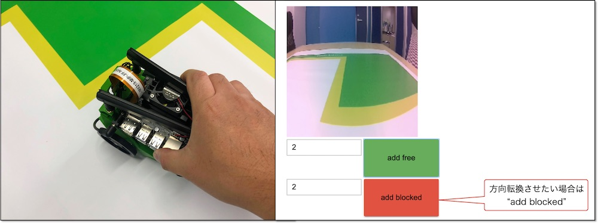
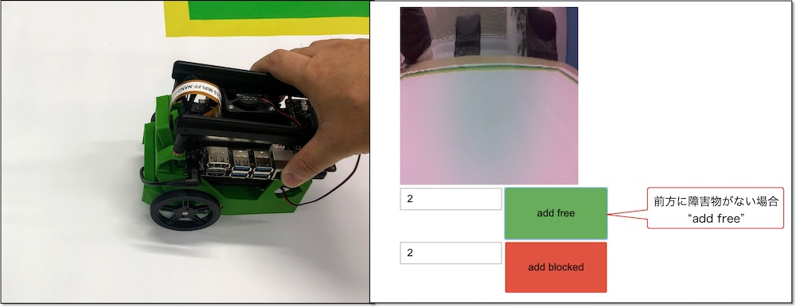

# 2.Datasetの作成

境界線や障害物を認識されるために``add blocked``のラベルの30枚+``add free``のラベルの30枚(合計 60枚)のデータ・セットを作成し、保存します。

## Notebook

Jupyter上で、~/Notebooks/collision_avoidanceを開きます。

## データ・セットの作成

Jupyterを実行していくと、datasetフォルダが生成され、フォルダ下に画像が保存されていきます。

Jetbotを回転させたい時は``add blocked``、そのまま走行されたい時は、``add free``で写真を登録していきます。

## add blocked

前方に境界線や障害物がある場合、``add blocked``に登録します。

## add free

前方に境界線や障害物がない場合、``add free``に登録します。

