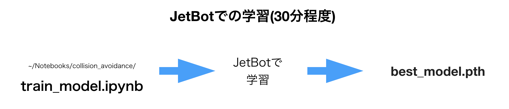
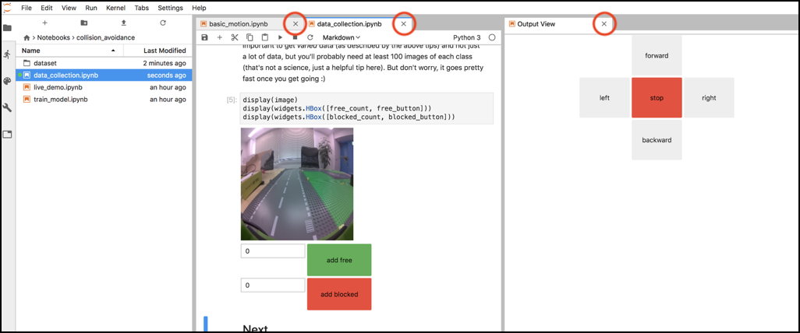
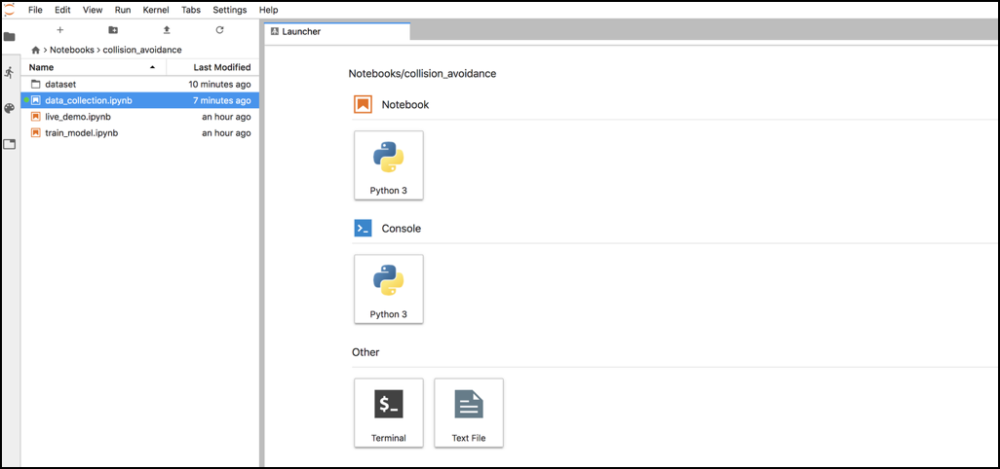
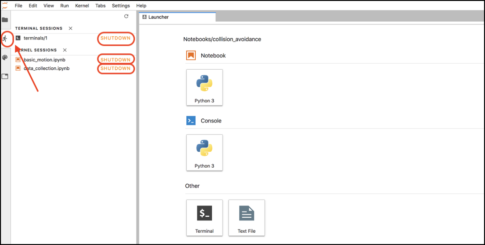
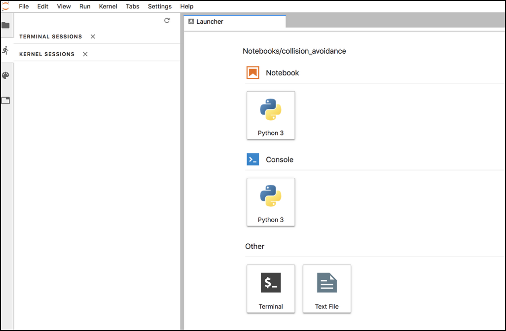
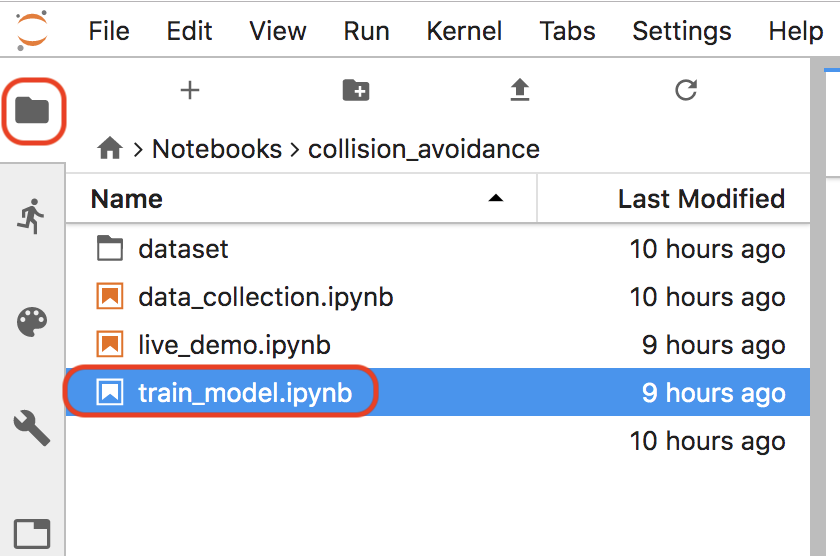
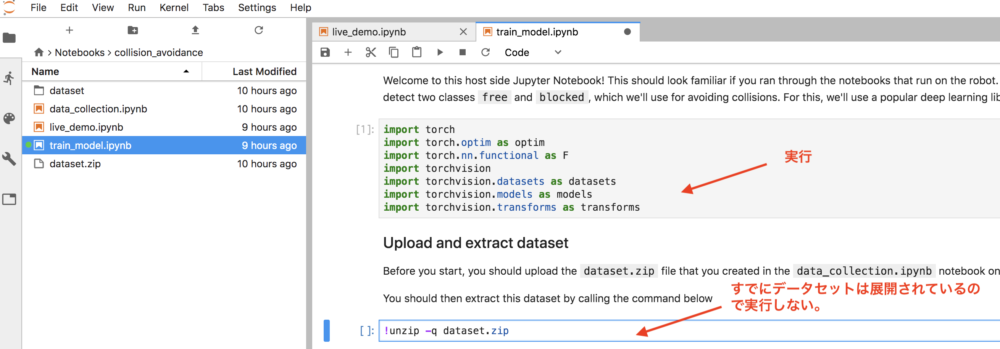
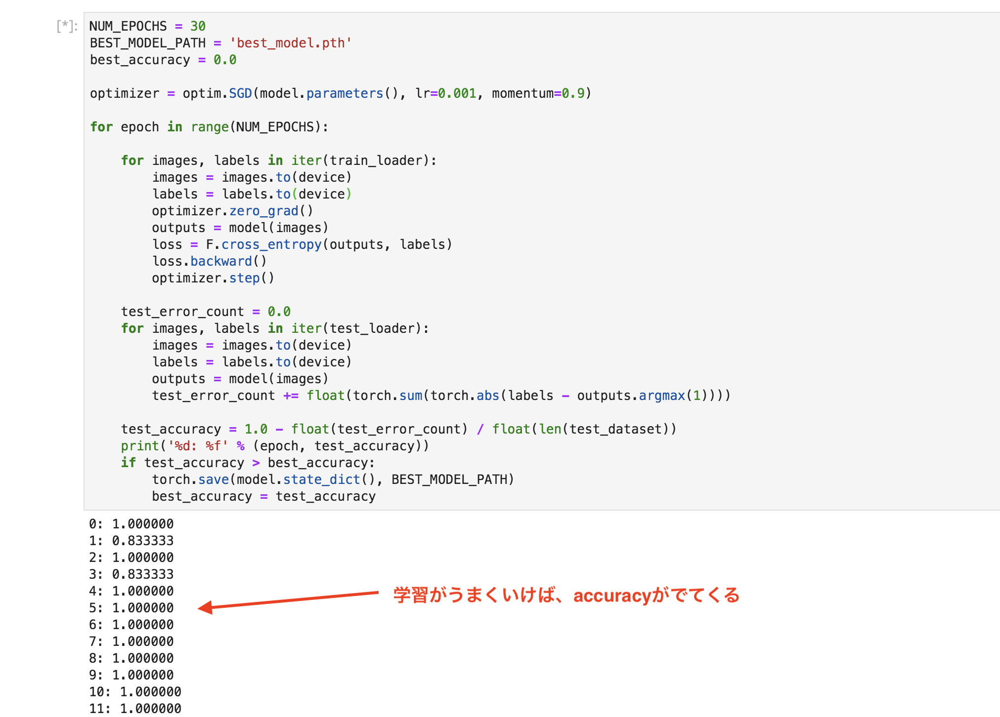
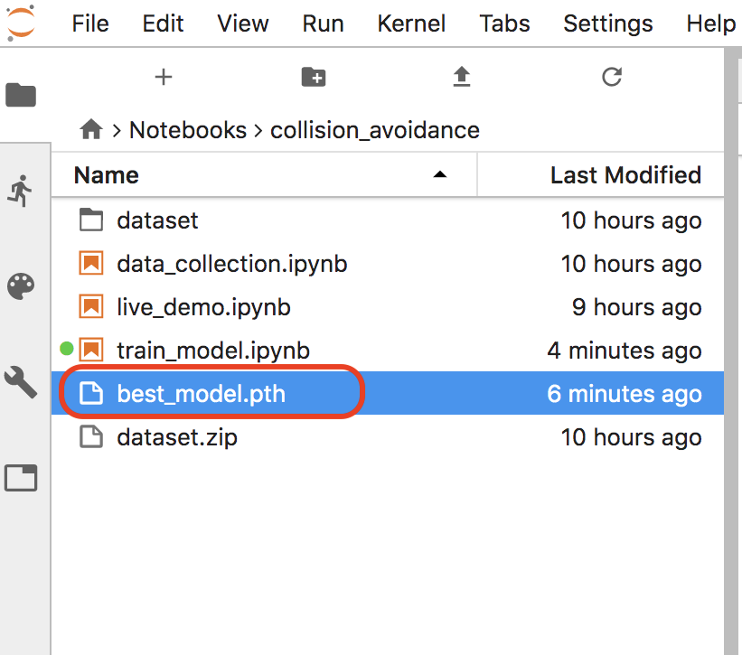

# Jetbotでの学習

Jetson nanoでは、Jetson nano上で、そのまま学習が可能です。その一方で電力消費、メモリ消費が多くなるので、今まで起動しているプロセスをシャットダウンします。

## プロセスのシャットダウン

NotebookやTerminalのプロセスをシャットダウンします。

## 学習用 Notebook

Jupyter上で、~/Notebooks/collision_avoidance/train_model.ipynbを開きます。

Datasetはすでに展開済みなので、下記処理はSkipします。

順番に実行していき、最後の学習が始まるとAccuracyが表示されます。

best_model.pthが生成されれば、学習は成功です。

