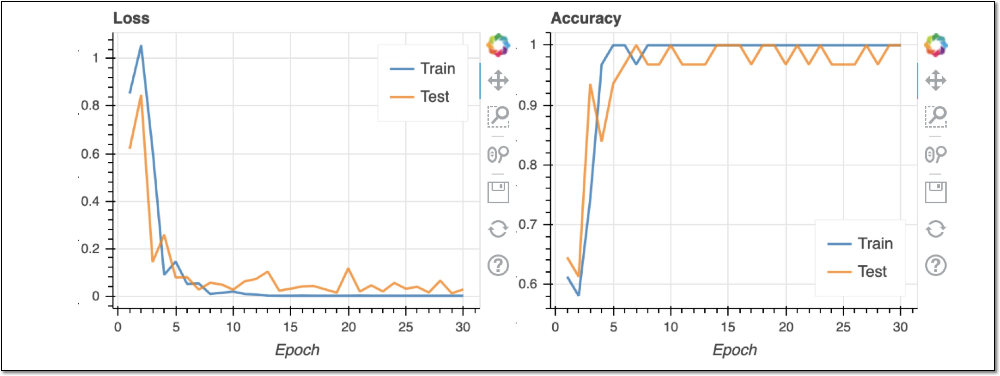

# 3.Jetbotでの学習

Jetson nanoでは、Jetson nano上で、そのまま学習が可能です。その一方で電力消費、メモリ消費が多くなるので、今まで起動しているNotebookをシャットダウンします。

## 学習用 Notebook

Jupyter上で、~/Notebooks/collision_avoidance/train_model.ipynbを開きます。

data_collection.ipynbのプロセスをshutdownします。

Notebookのcellを実行していくと、最後に学習が始まります。30 EPOCH学習します。

best_model.pthが生成されれば、学習は成功です。

