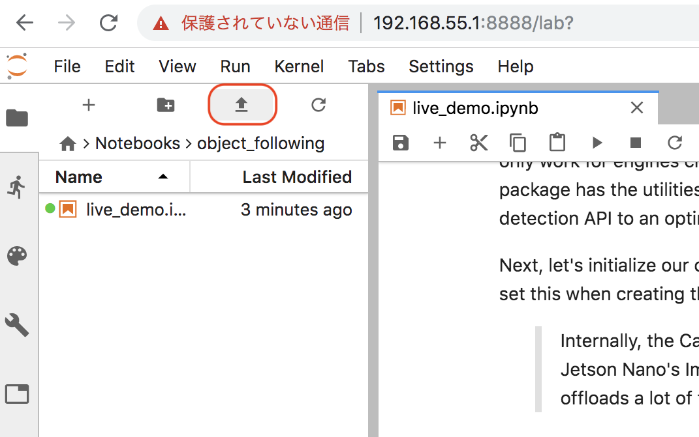
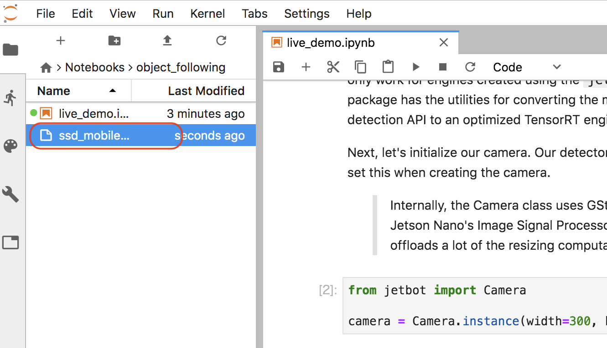

# Object Following

Object Followingは、学習済みモデルを使ったデモのみサンプルになります。

[ssd_mobilenet_v2_coco.engine](https://drive.google.com/file/d/1RnNBHPDphIOWwHCSfeMCWQ7XN3w3tKFD/view) をダウンロードし、Object FollowingのNotebookのフォルダにアップロードします。

## Notebookの実行

Object FollowingのNotebookは、データセット作成はおこなわず、学習済みモデルでのデモになります。

デモでは、人を追従して、後を追ってきます。

