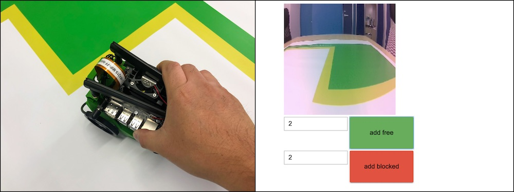
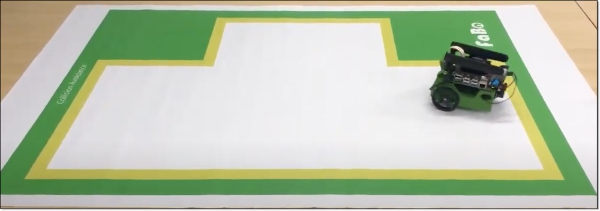
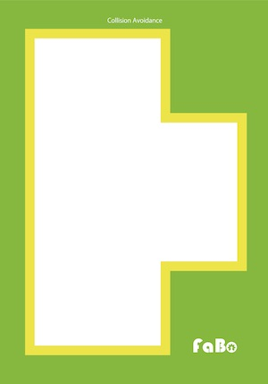
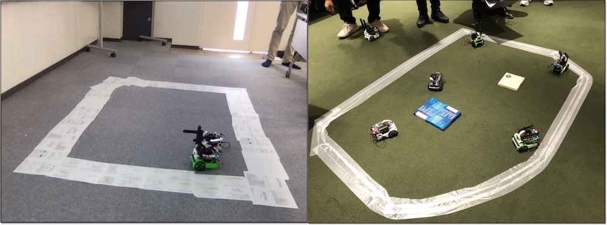

# 1.Collision Avoidance

Collision Avoidanceでは、衝突回避しながら自動走行することができます。

## 学習のススメ方

1,2,3,4の順で実行します。各項目が終わったらNotebookのShutdownを忘れないようにしてください。

|項目|ノートブック|操作|写真|
|:--|:--|:--|:--|
|1.データ収集|01_data_collection_JP.ipynb|JetBotを使ってデータを収集||
|2.学習|02_train_model_JP.ipynb|収集したデータを学習||
|3.変換|03_live_demo_build_trt_JP.ipynb|学習したPytorchモデルをTensorRTモデルに変換||
|4.デモ走行|04_live_demo_trt_JP.ipynb|学習結果でデモ走行||

## コース

研修で利用するコースは、FaBo製の``Collision Avoidance``コースの利用をお勧めします。

コースが準備できない場合は、下記例のような境界線を明確にしたエリアを作成してください。

## デモ走行　

