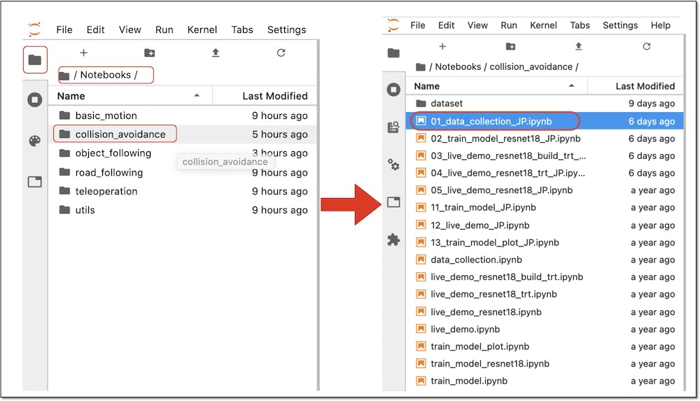

# 2.Datasetの作成

境界線や障害物を認識されるために「blocked」ラベルの30枚+「free」ラベルの30枚(合計 60枚)のデータセットを作成します。

## データ収集(01_data_collecion_JP.ipynb)

Jupyter上で、`~/Notebooks/collision_avoidance/01_data_collecion_JP.ipynb`を開きます。  
「~」はチルダと呼び、ホームディレクトリ(/home/jetbot)のことを指します。

Jupyterを実行していくと、datasetディレクトリが生成され、その下に「blocked」と「free」に分類して画像が保存されます。

JetBotを回転させたい時は「blockedに保存」、そのまま走行されたい時は「freeに保存」をクリックすることでデータセットが作成されます。

## blockedに保存

前方に境界線や障害物がある場合は「blockedに保存」ボタンをクリックします。

## freeに保存

前方に境界線や障害物がない場合は「freeに保存」ボタンをクリックします。

