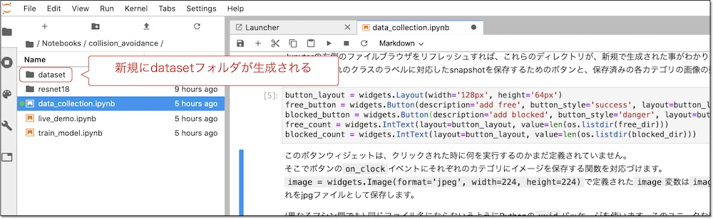

# 2.Datasetの作成

境界線や障害物を認識されるために「blocked」ラベルの30枚+「free」ラベルの30枚(合計 60枚)のデータセットを作成します。

## データ収集(01_data_collecion_JP.ipynb)

Jupyter上で、`~/Notebooks/collision_avoidance/01_data_collecion_JP.ipynb`を開きます。  
「~」はチルダと呼び、ホームディレクトリ(/home/jetbot)のことを指します。

Jupyterを実行していくと、datasetディレクトリが生成され、その下に「blocked」と「free」に分類して画像が保存されます。

JetBotを回転させたい時は「blockedに保存」、そのまま走行されたい時は「freeに保存」をクリックすることでデータセットが作成されます。

## blockedに保存

前方に境界線や障害物がある場合は「blockedに保存」ボタンをクリックします。

## freeに保存

前方に境界線や障害物がない場合は「freeに保存」ボタンをクリックします。

## 実行ログの消去

Jupyterノートブックは実行ログも保存されます。  
カメラエラーの発生時に再起動をおこなう場合があります。  
再実行時に前回の実行ログが残ったままだと、今どこを実行しているのかわからなくなるため、ログを消去しておくことをお勧めします。  
ログの消去はJupyterカーネルも終了するため、再起動直後、もしくは実行後であればカメラ停止後におこなってください。

実行中にエラーが発生！  
カメラ停止は実行済みです。  
実行番号と出力を消去したいとおもいます。

Jupyterメニューの「Kernel」->「Restart Kernel and Clear All Outputs...」を選択。

選択肢が表示されるので、「Restart」をクリックします。

実行番号と出力が消去されました。この状態で保存しておくと、次回実行時に迷わず実行できます。

