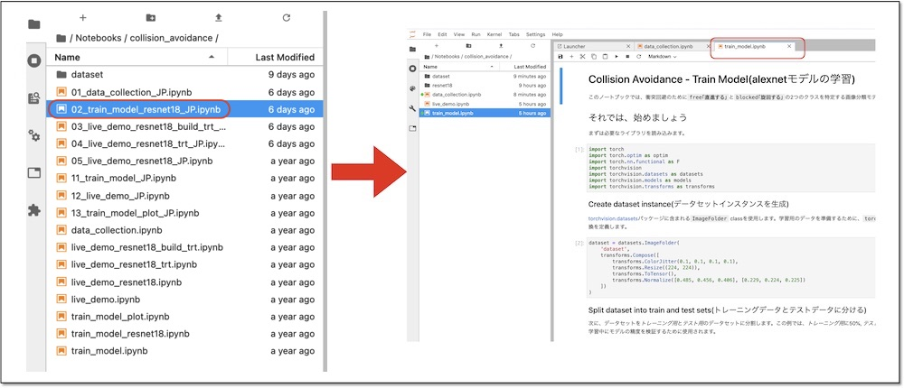
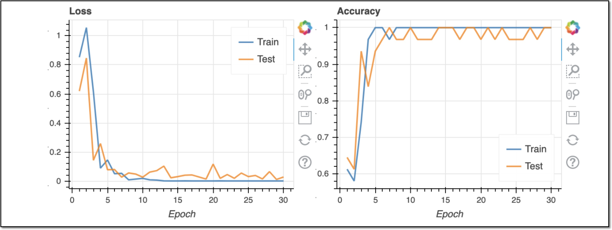
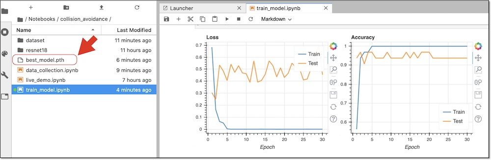

# 3.Jetbotでの学習

学習はJetBotに搭載しているJetson Nanoでおこなうことができます。その一方で電力消費、メモリ消費が多くなるので、今まで起動しているNotebookをすべてシャットダウンします。

## 学習(02_train_model_JP.ipynb)

Jupyter上で、~/Notebooks/collision_avoidance/02_train_model_JP.ipynbを開きます。

01_data_collection_JP.ipynbのプロセスをshutdownします。

Notebookのcellを実行していくと、最後に学習が始まります。30エポック学習します。

best_model.pthが生成されれば、学習は成功です。

