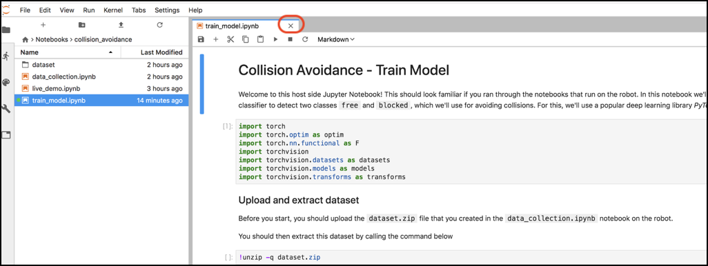
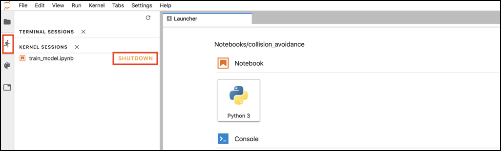
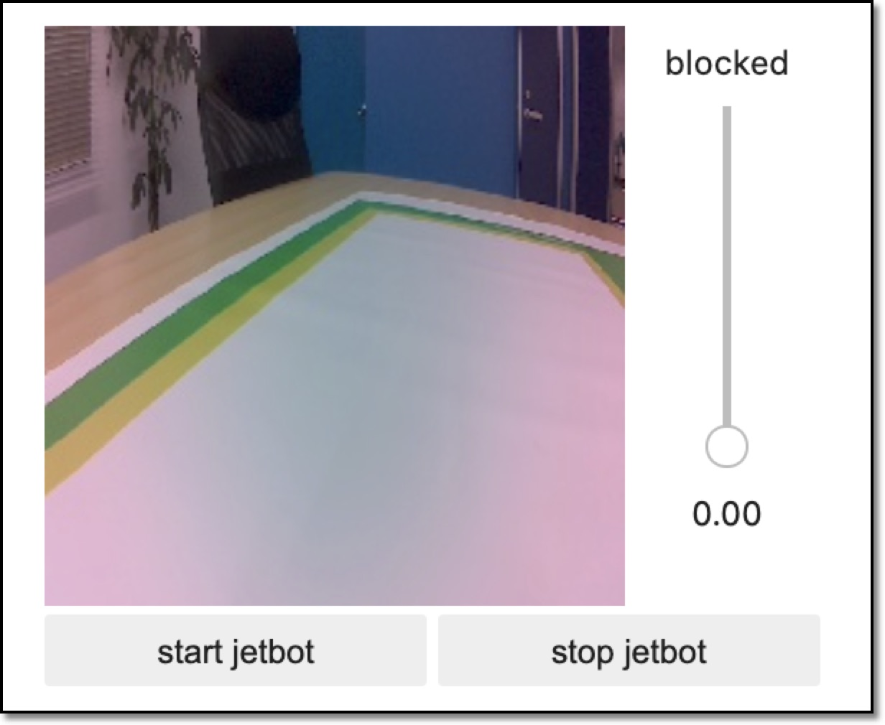

# 4.Jetbotでの実行

## 学習済みモデル

Jetsonでのローカルでの学習から、学習済みモデルであるbest_model.pthが同じフォルダに、生成されています。

## プロセスのシャットダウン

実行時メモリが足りなくなるので、前回までのサンプルを終了します。

## Live demoの実行

Jupyter上で、~/Notebooks/collision_avoidance/live_demo.ipynbを開きます。

Cellを実行していき、下記画面がでてきたら、``[start jetbot]``をクリックし、推論での走行を実行します。(学習済みモデルの読み込みで起動までに20数秒かかります。)

