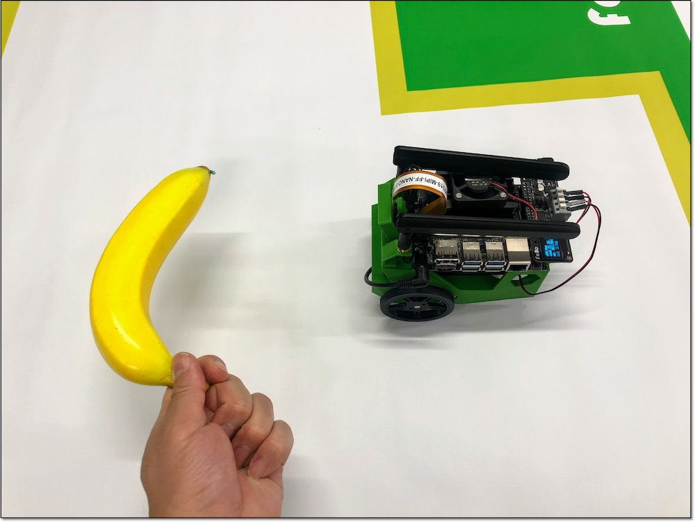

# 1.学習のススメ方
この項目は現在  
・Jetson Nano 4GB + JetPack 4.6 + Docker faborobot/jetbot-jp46-trt823 (2022/03)  
で対応しています。

Object Followingでは、データの収集と学習はおこなわず、collision avoidanceで学習したResNet18モデルと、90種類の物体検出が可能な既存モデルのssd mobilenet v2 fpnliteをつかって指定したオブジェクトの追従をおこないます。

## 学習のススメ方

各項目が終わったらノートブックのSHUT DOWNを忘れないようにしてください。

|項目|Notebook|操作|写真|
|:--|:--|:--|:--|
|1.物体検出モデル変換|01_build_ssd_engine_JP.ipynb|物体検出モデルをTensorRTモデルに変換||
|2.デモ走行|02_live_demo_JP.ipynb|学習結果でデモ走行||

## 必要なもの

|項目|概要|
|:--|:--|
|Collision Avoidanceでの学習済みモデル(ResNet18 TensorRTモデル)|境界線に差し掛かったら回転させる用途で使用|
|Collision Avoidanceで使ったコース|Collision Avoidanceの認識用|
|認識させる物体|バナナ等|

## デモ走行

