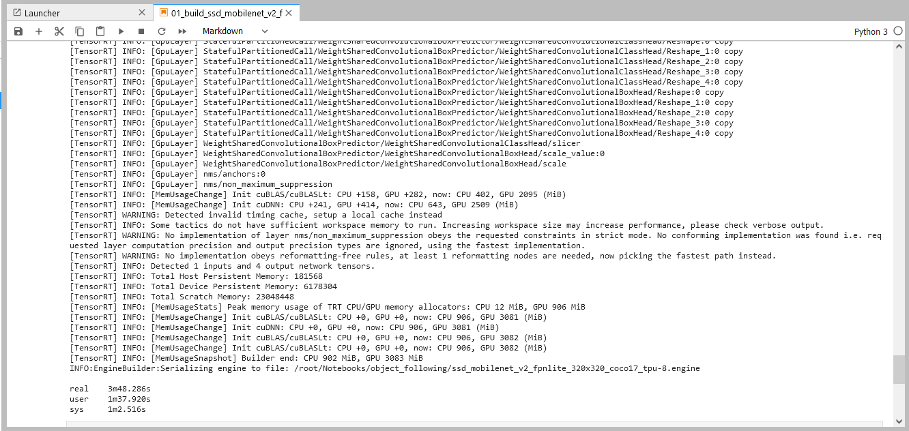

# 2.物体検出モデル ssd_mobilenet_v2_fpnlite
Tensorflow2 Object Detectionの物体検出モデルをTensorRTモデルに変換します。
本来ならば、Tensorflowの学習済みモデルをダウンロードして、中間モデルのONNXモデルに変換してからTensorRTモデルに変換しますが、ここでは時間短縮のためにあらかじめ用意してあるONNXモデルを使うことにします。
TensorRTモデルはGPUやTensorRTバージョン毎に最適化が異なるため、実行環境上でONNXモデルからTensorRTモデルに変換する必要があります。

## 01_build_ssd_mobilenet_v2_fpnlite_JP.ipynb

