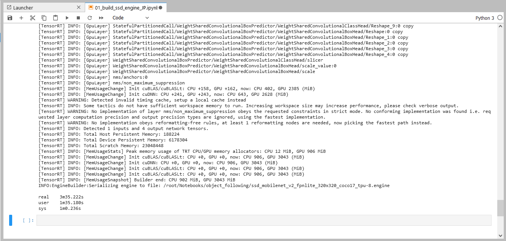

# 2.物体検出モデル
Tensorflow2 Object Detectionの物体検出モデルをTensorRTモデルに変換します。  
本来ならば、Tensorflowの学習済みモデルをダウンロードして、ONNXモデルに変換してからTensorRTモデルに変換しますが、  
高速化のために不要な低スコアの検出結果を排除するようにモデルを書き換えたONNXモデルを用意してあります。  
TensorRTモデルはGPUやTensorRTバージョン毎に最適化が異なるため、実行環境上でONNXモデルからTensorRTモデルに変換する必要があります。  

## 01_build_ssd_engine_JP.ipynb

