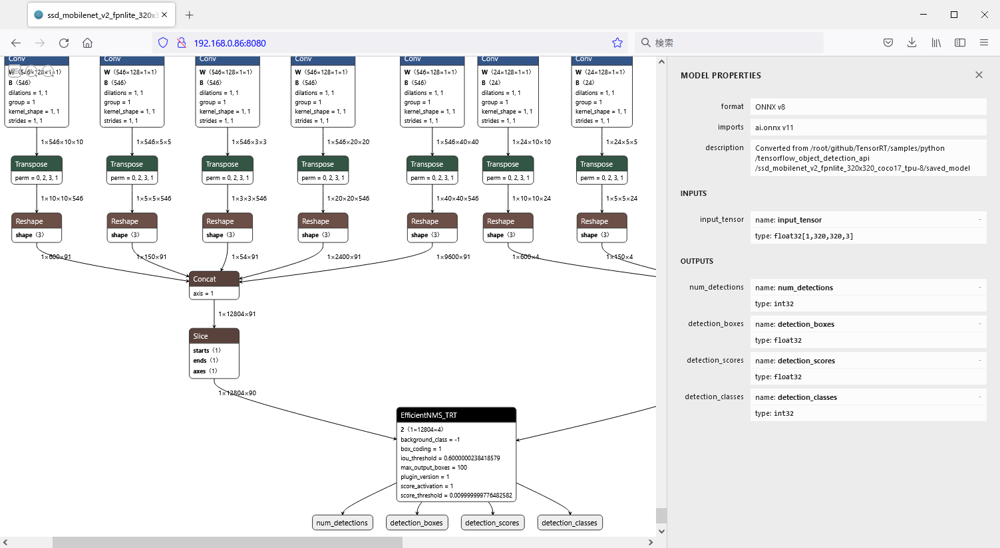

# 4.ONNXグラフ表示

## 物体検出モデルの構造を表示(03_onnx_graph_JP.ipynb)

ONNXモデルはnetronコマンドを使ってグラフ表示が可能になります。  
ブラウザでJetBotのIPアドレス:8080にアクセスすると、ONNXモデルの構造を確認することができます。  
InputノードとOutputノードのサイズやノード名を確認するのに役立ちます。  

