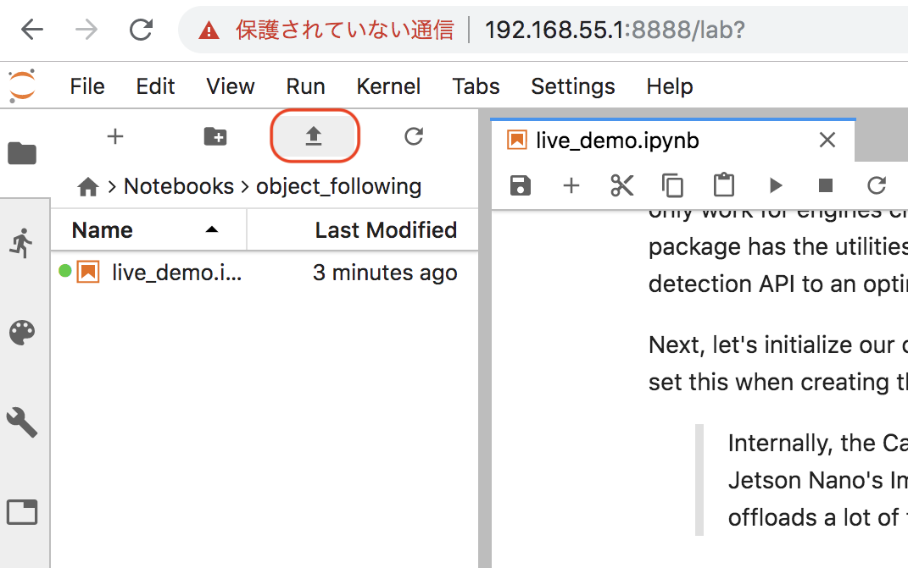
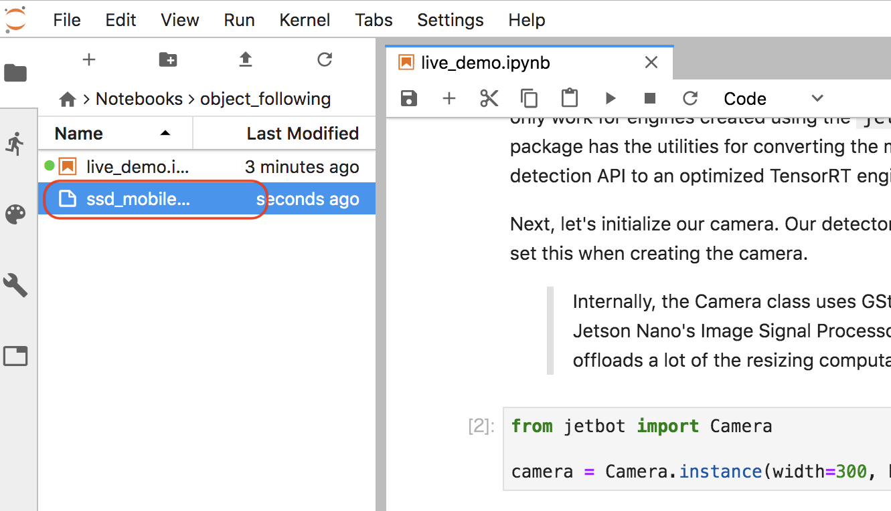

# Object Following

Object Followingは、学習済みモデルを使ったデモのみサンプルになります。

|JetPack|Download|
|:--|:--|
|4.3用|[ssd_mobilenet_v2_coco.engine](https://drive.google.com/file/d/1KjlDMRD8uhgQmQK-nC2CZGHFTbq4qQQH/view) |
|4.2用|[ssd_mobilenet_v2_coco.engine](https://drive.google.com/file/d/1RnNBHPDphIOWwHCSfeMCWQ7XN3w3tKFD/view) |

をダウンロードし、Object FollowingのNotebookのフォルダにアップロードします。

## Notebookの実行

Object FollowingのNotebookは、データセット作成はおこなわず、学習済みモデルでのデモになります。

デモでは、人を追従して、後を追ってきます。

