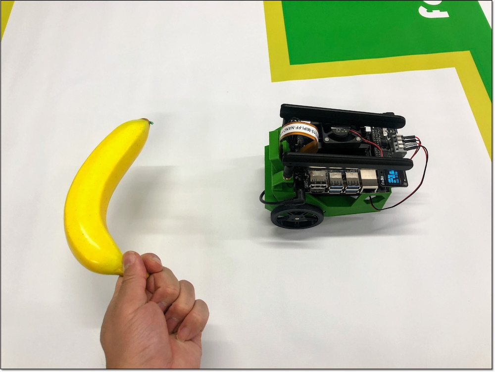

# 1.学習のススメ方
この項目は現在Jetson Nano 4GB + JetPack 4.3のみ対応しています。

Object Followingでは、データの収集と学習はおこなわず、collision avoidanceで学習したAlexNetモデルと、90種類の物体検出が可能な既存モデルのssd mobilenet v2をつかって指定したオブジェクトの追従をおこないます。

## 学習のススメ方

各項目が終わったらNotebookのShutdownを忘れないようにしてください。

|項目|Notebook|操作|写真|
|:--|:--|:--|:--|
|1.デモ走行|01_live_demo_JP.ipynb|学習結果でデモ走行||

## 必要なもの

|項目|概要|
|:--|:--|
|Collision Avoidanceでの学習済みモデル(AlexNet)|境界線に差し掛かったら回転させる用途で使用|
|Collision Avoidanceで使ったコース|Collision Avoidanceの認識用|
|ssd_mobilenet_v2_cocoの学習済みモデル|[ssd_mobilenet_v2_coco.engine](https://drive.google.com/file/d/1KjlDMRD8uhgQmQK-nC2CZGHFTbq4qQQH/view)(JetPack4.3用)|
|認識させる物体|バナナ等|

## デモ走行

