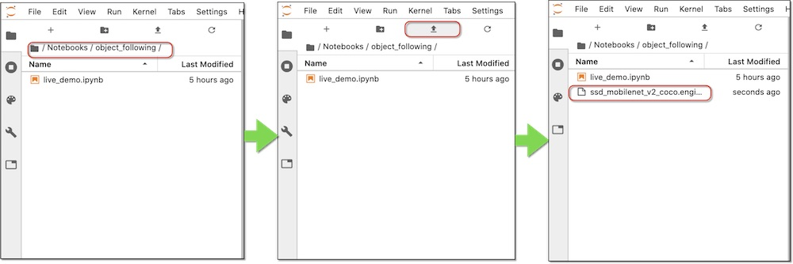

# 2.自動走行

物体追跡には、JetBot用に改修された物体追跡モデルが必要になります。

|JetPack|Download|
|:--|:--|
|4.3用|[ssd_mobilenet_v2_coco.engine](https://drive.google.com/file/d/1KjlDMRD8uhgQmQK-nC2CZGHFTbq4qQQH/view) |
|4.2用|[ssd_mobilenet_v2_coco.engine](https://drive.google.com/file/d/1RnNBHPDphIOWwHCSfeMCWQ7XN3w3tKFD/view) |

ssd_mobilenet_v2_coco.engineが無い場合は、上記からJetPack 4.3用のモデルをダウンロードし、Object Followingのフォルダにアップロードしてください。

## 自動走行(01_live_demo_JP.ipynb)

自動走行では、直進できる場合に物体を追従するように走行します。

