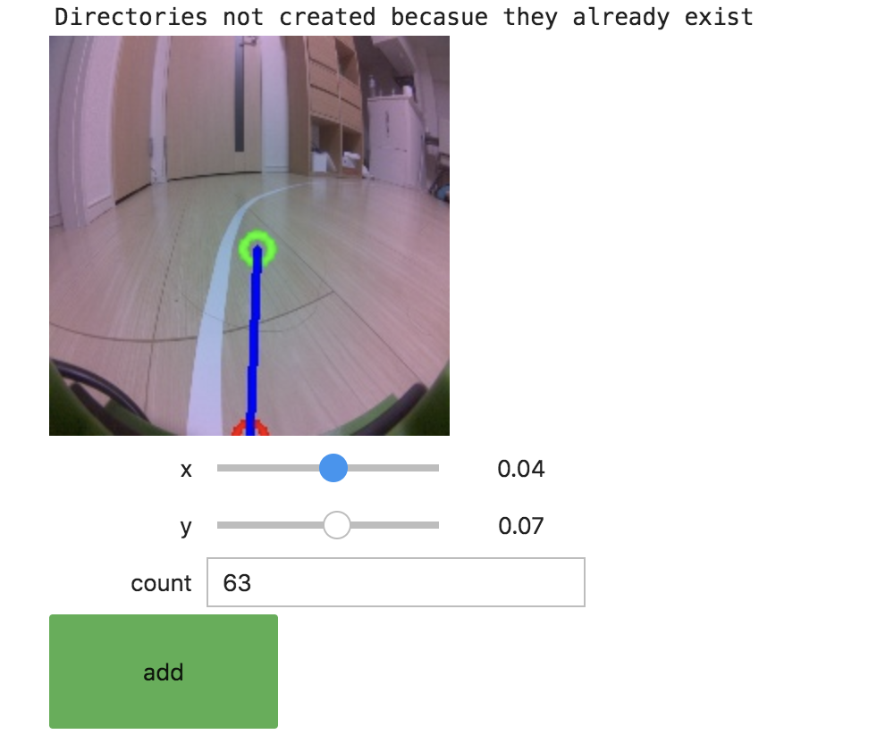

# Road Following

Road Followingは、[https://github.com/FaBoPlatform/jetbot.git](https://github.com/FaBoPlatform/jetbot.git) のサンプルを使って実行します。

## Datasetの登録

|Notebook|用途|
|:--|:--|
|data_collecion.ipynb|データ・セット作成用|
|live_demo.ipynb|実行用|
|train_model.ipynb|トレーニング用|

[https://github.com/FaBoPlatform/jetbot.git](https://github.com/FaBoPlatform/jetbot.git) のサンプルでは、マウスだけでdatasetが作成できるように改造してあります。

## Datasetの作り方

JetBotを対わせたい方向に、○を移動し、addボタンで、データセットとして登録します。

Datasetの作成が終わったら、`train_model.ipynb` で学習し、`live_demo.ipynb`で実行します。