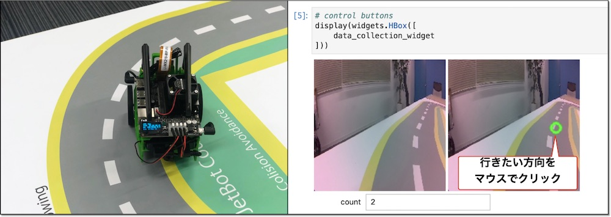
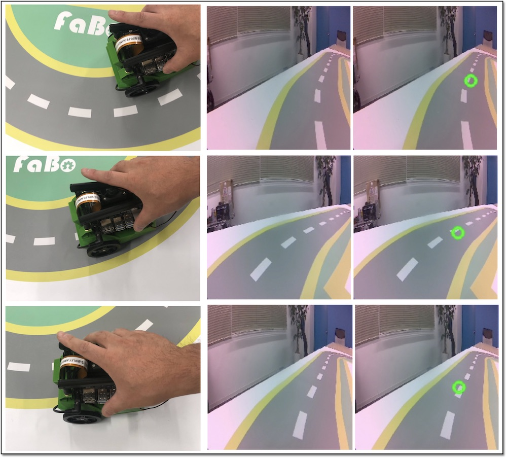
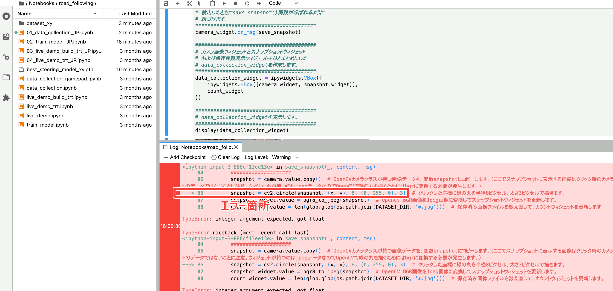

# 2.データ収集
自動走行のお手本となるデータを作成します。


## データ収集(01_data_collection_JP.ipynb)

Jupyter上で、`~/Notebooks/road_following/01_data_collection_JP.ipynb`を開きます。  

JetBotをコースに設置し、走行させたい方向をマウスでクリックし、データセットを作成していきます。



1つのコーナーでも、様々な角度でJetBotがコーナーに入ってくる可能性がありますので、3パターン程度の入射角度に対応するデータセットを作成しておきます。



50データセット以上のデータを作成してください。


## エラーが発生する場合
Google Chromeの一部のセッション環境ではマウスクリック時に取得できる画像のx,y座標がfloat型で返ってくるため、OpenCVの円を描画する座標の中心点が期待するint型と不一致となるために以下の画像にあるようなエラーが発生することがわかっています。

このようなエラーが発生した場合は、原因となっているx,yをint型に変換するように変更してください。  
変更前
```
snapshot = cv2.circle(snapshot, (x, y), 8, (0, 255, 0), 3)
```
変更後
```
snapshot = cv2.circle(snapshot, (int(x), int(y)), 8, (0, 255, 0), 3)
```




