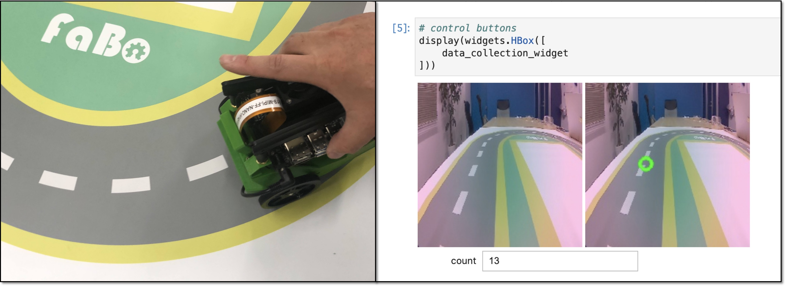
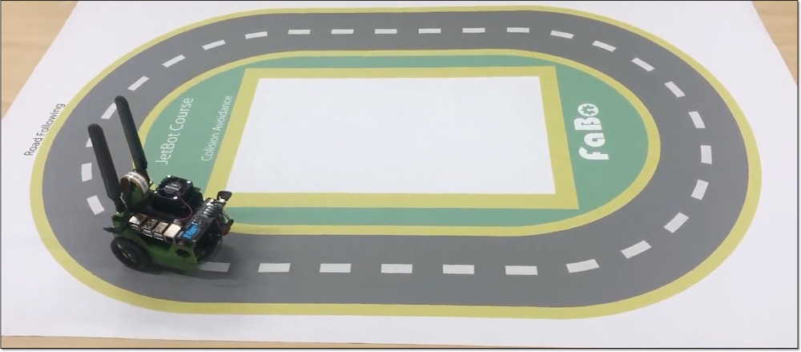
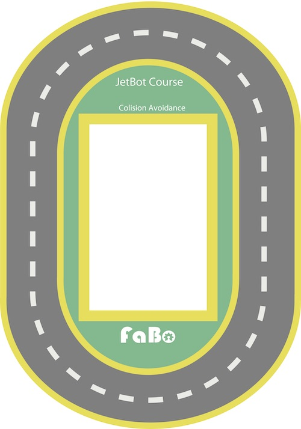
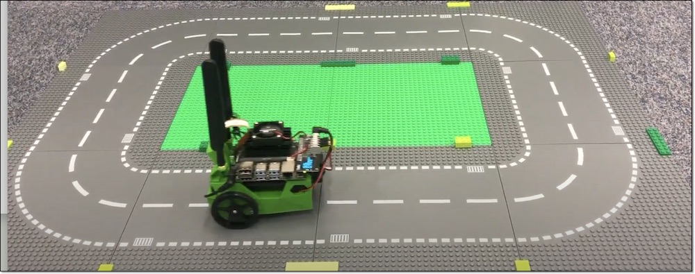

# 1.学習のススメ方

Road Followingでは、道路の自動走行が可能です。

## 学習のススメ方

1,2,3の順で実行します。各項目が終わったらNotebookのShutdownを忘れないようにしてください。

|項目|Notebook|操作|写真|
|:--|:--|:--|:--|
|1.データ収集|data_collection.ipynb|Jetbotを使ってデータを収集||
|2.学習|train_model.ipynb|転移学習で収集したデータを学習||
|3.デモ走行|live_demo.ipynb|学習結果でデモ走行||

## コース

コースは、集団研修では、FaBo製の``Road following``コースの利用をお勧めします。

Legoシティの道路などもコースに使います。

## デモ走行　

