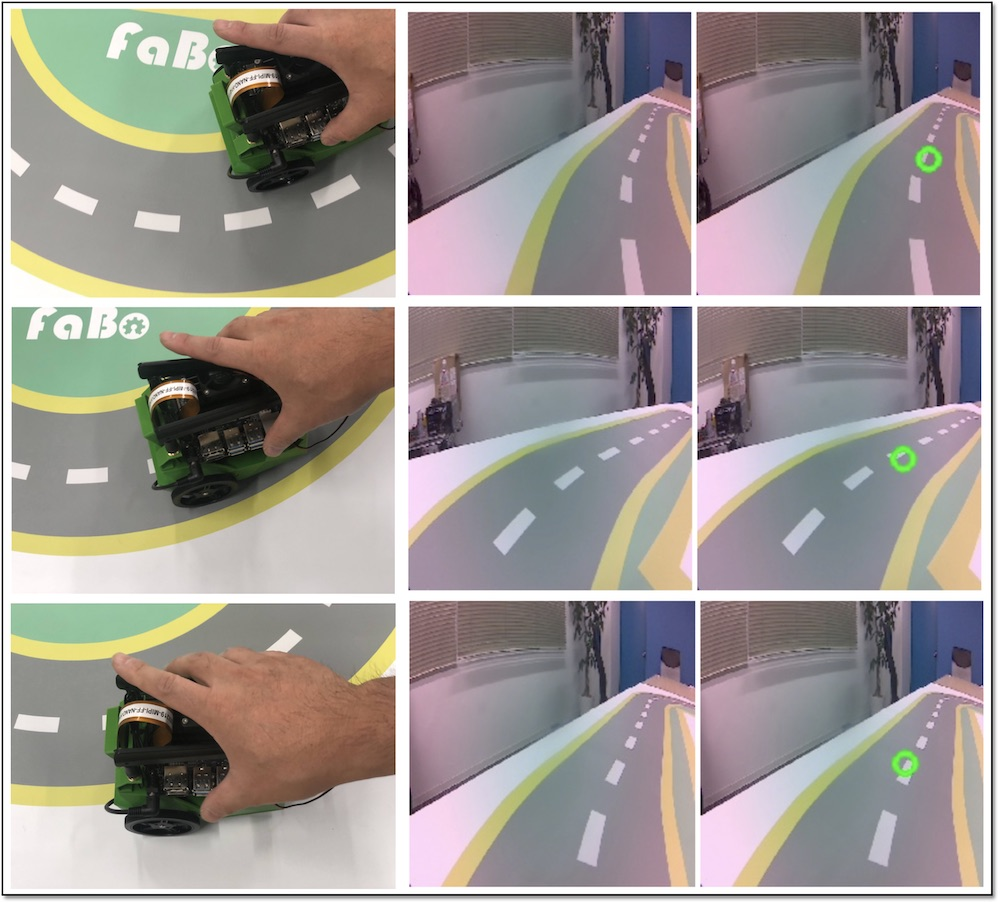

# 2.データ収集
自動走行のお手本となるデータを作成します。

## データ収集(01_data_collecion_JP.ipynb)

Jupyter上で、`~/Notebooks/road_following/01_data_collecion_JP.ipynb`を開きます。  

Jetbotをコースに設置し、Jetbotを走行させたい方向をマウスでクリックし、データセットを作成していきます。

1つのコーナーでも、様々な角度でJetbotがコーナーに入ってくる可能性がありますので、3パターン程度の入射角度に対応するデータセットを作成しておきます。

50データセット以上のデータを作成してください。
