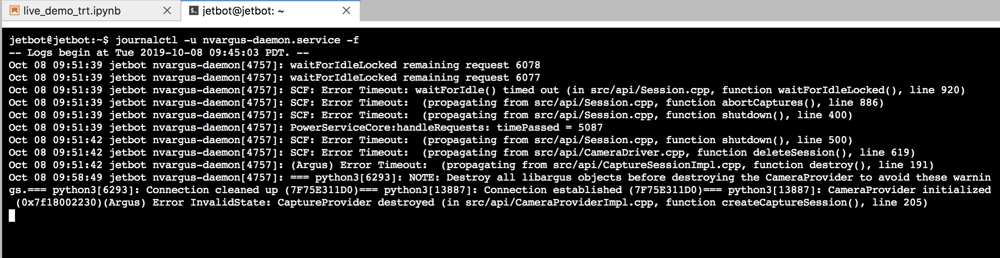
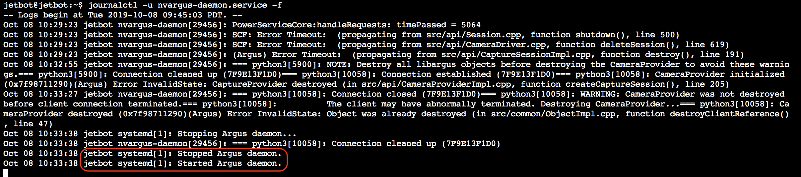

# カメラのトラブルシューティング

カメラ関連のエラー

```
journalctl -u nvargus-daemon.service -f
```



カメラ関連のDaemon再起動

!!! warning
	本作業を実施する際、Jupyter notebookの全notebookのプロセスをシャットダウンして、下記手順を実施してください。

```
sudo systemctl restart nvargus-daemon
```

を実行しnvargus-daemonを再起動します。

```
journalctl -u nvargus-daemon.service -f
```

を実行し、nvargus-daemonが再起動された事をログで確認します。




