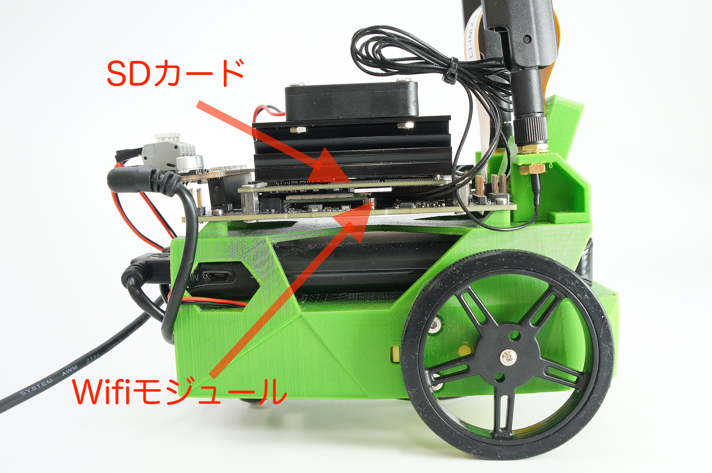
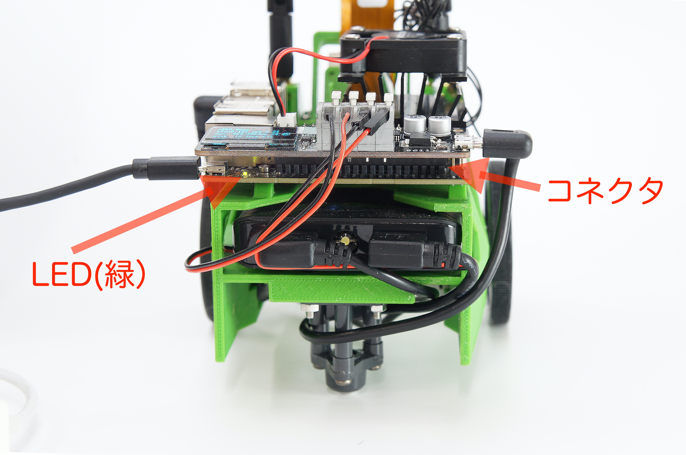

# 質問するときのお願い

トラブル等でご質問するときは、以下のような写真を参考にして、上,横,後それぞれ３枚アップするとトラブルが解決しやすくなります。

## JetBotの上から

!!!POINT "手振れ"
	手振れに注意してください。

## JetBotの横から

!!!POINT "SDカード、Wifiモジュール"
	SDカード、Wifiモジュールがなるべく見えるように撮影します。

## JetBotの後ろから

!!!POINT "LED"
	LEDとコネクタが見えるように撮影してください。

