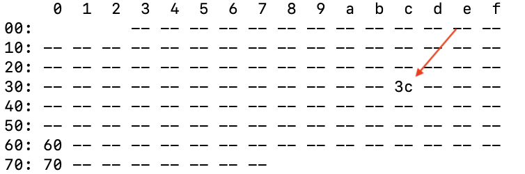

# OLEDが表示されない

## OLEDのデバイスの認識の確認

```
sudo i2cdetect -r -y 1
```



アドレス番地 '0x3c' を認識していれば、OLEDのデバイスは見えている状態です。

## Wi-Fiモジュールの未装着の場合

NVIDIA公式のJetBotイメージ(Jetpack4.2, Jetpack4.3)は、Wi-Fiモジュールが装着されていない場合、OLEDが表示されません。

/usr/local/lib/python3.6/dist-packages/jetbot-0.4.0-py3.6.egg/jetbot/utils/utils.py のget_ip_addressを下記のように書き直してください。

```
def get_ip_address(interface):
    try:
        if get_network_interface_state(interface) == 'down':
            return None
        cmd = "ifconfig %s | grep -Eo 'inet (addr:)?([0-9]*\.){3}[0-9]*' | grep -Eo '([0-9]*\.){3}[0-9]*' | grep -v '127.0.0.1'" % interface
    except:
        return None
    return subprocess.check_output(cmd, shell=True).decode('ascii')[:-1]
```

## 上記に該当しないケース

OLEDのデバイスが認識していて、Wi-Fiモジュールを装着しているにも関わらずOLEDが表示されない場合は、ハードウェアの故障の可能性があります。

[修理依頼フォーム](https://forms.gle/KS3FdeHD4sDEmYUXA)　より修理の依頼(無償修理)をお願いいたします。
