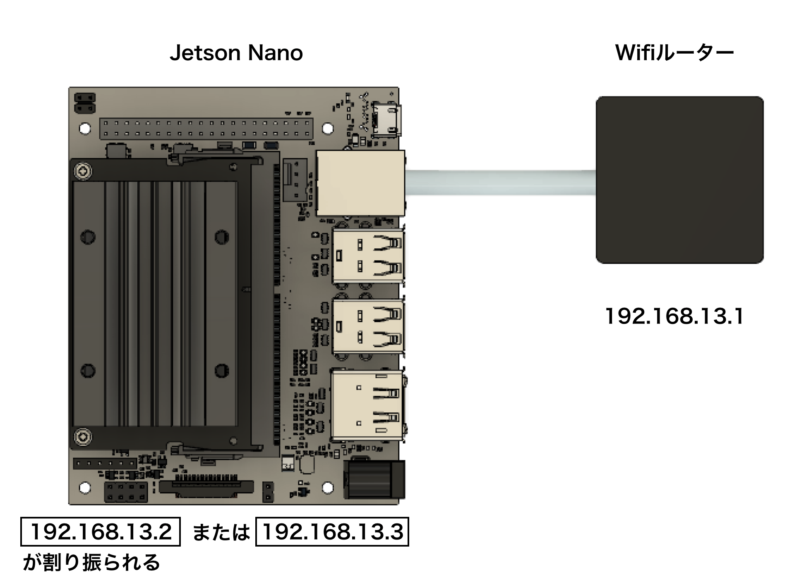
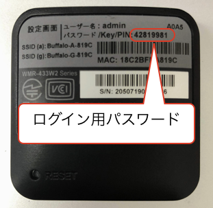

# ルーターの設定

Jetson Nanoに接続するにあたり、ルーターの設定をおこないます。

## 接続

Jetson Nanoには、`192.168.13.2` または`192.168.13.3`が割り振られ、Wifiルーターには、`192.168.13.1`(固定)が割り振られます。

## Wifiルーターへの接続

ルーターの設定を2.4GHzから5GHzに変更します。

ルーター裏面記載のSSIDとパスワードでPCから接続します。

## Wifiルーターの設定

Wifiルーターに接続した状態で、ルーターの　IPアドレスである`192.168.13.1`にブラウザから接続します。

ページへのログインは、IDが`admin`、パスワードがWifiルーター裏面のパスワードを入力します。

`設定ウィザード`を選択し、[次へ]をクリックします。

`ローカルモード`を選択し、[次へ]をクリックします。

ルーターの再起動が完了するとWifiルーターがローカルモードで起動します。