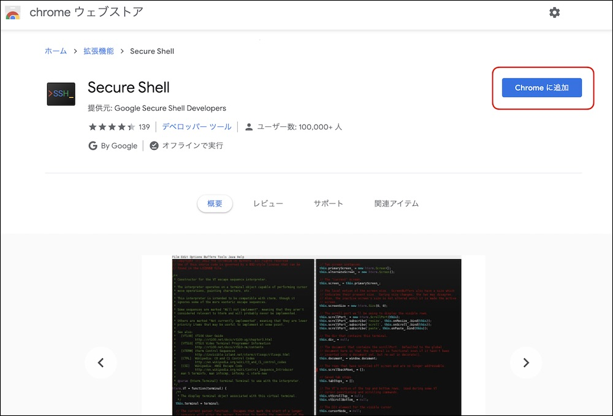
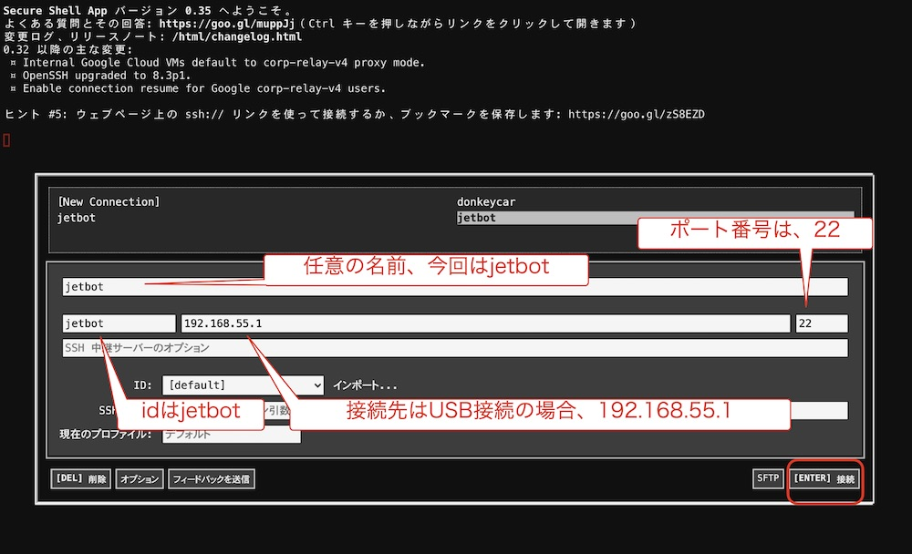

# SSHでJetBotに接続

Secure Shell(Google製)を用いて、Chrome browserからSSHでJetBotに接続します。　

## Secure shellのインストール

Chrome AppStoreにアクセスし、Secure shellをインストールします。

[secure shell](https://chrome.google.com/webstore/detail/secure-shell/iodihamcpbpeioajjeobimgagajmlibd?hl=ja&)

## Secure shellの実行

Chrome browserのURLフォームに、`chrome://app`と入力し、Chromeアプリの一覧を表示し、Secure shellを起動します。

## JetBotに接続

|password|
|:-|
|jetbot|