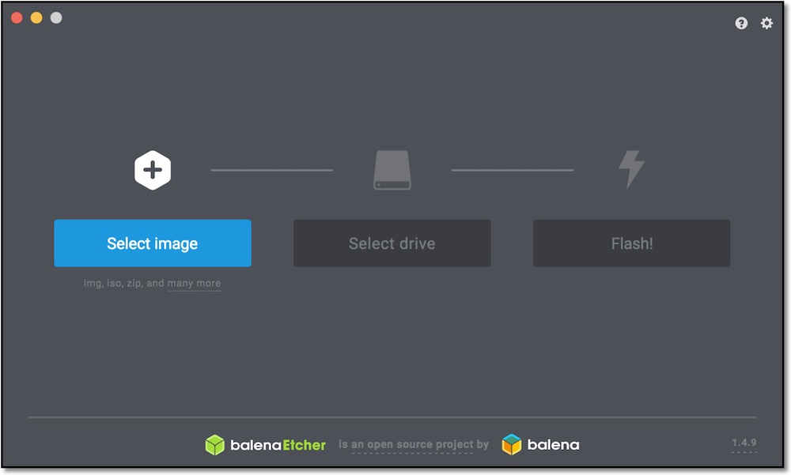
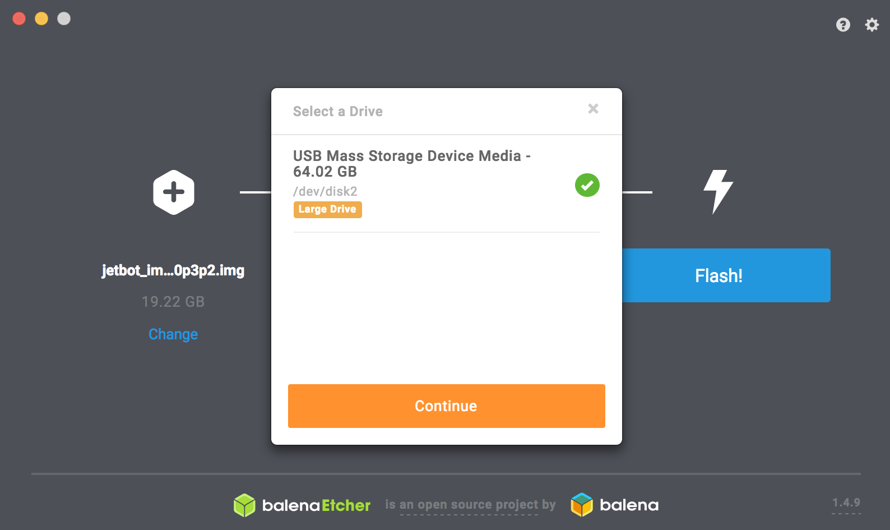

# SDカードの作成

## SDカードイメージダウンロード

!!! Warning
	FaBo Storeより、JetBotをご購入の方は、ダウンロード不要です。

FaBoで作成しているSDカードイメージはこちらからダウンロードできます。

|  対象Jetson  |  JetPack  | リンク先  |
|:-----------|:------------|:------------|
|  JetBot ２GBモデル  |Jetpack4.6|  [jetbot-nano-4gb-jp46-2022-02-03.zip](https://drive.google.com/file/d/1tLDoXoaiimS2tn02NJtUBE7tfmjq4mjh/view?usp=sharing)|
|  JetBot ４GBモデル  |Jetpack4.6|  [jetbot-nano-4gb-jp46-2021-12-08.zip](https://drive.google.com/file/d/1kCc8-WzXjfsZwki2hwdwUsTFAujELF6H/view?usp=sharing)|

## SDカードの焼き込み

SDカードのイメージは、[Etcher](https://www.balena.io/etcher/)を用いて、SDカードに焼き込みます。

セレクトイメージボタンを選択して、

ダウンロードして解凍したimgファイルを選択します。

焼きこむドライブを選択し、

フラッシュボタンを押します。

