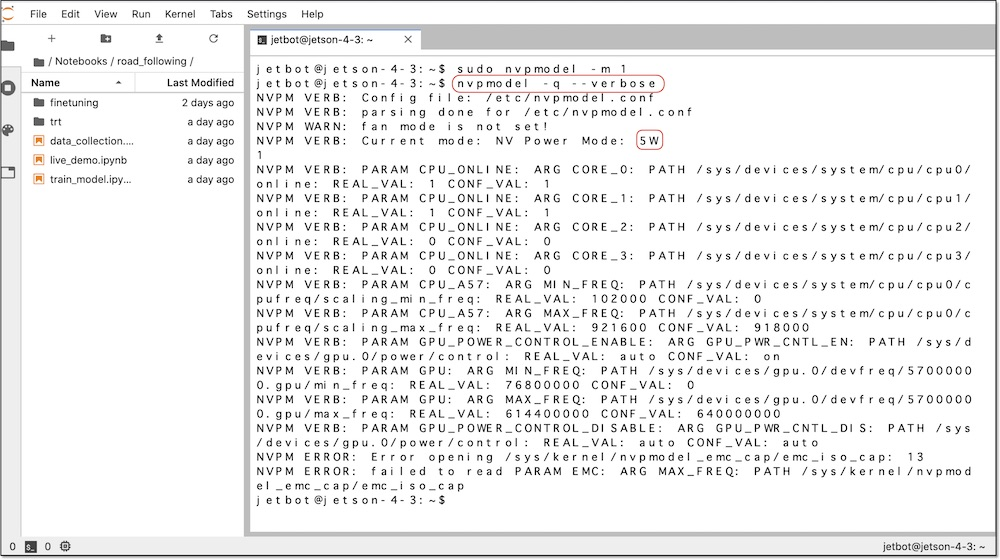

# 電力モード

Jetson Nanoでは、2つの電力モードが存在しています。

|モード|コマンド|CPU数|最大CPUクロック|最大GPUクロック|
|:--|:--|:--|:--|:--|
|5W|sudo nvpmodel -m 1|2|918MHz|640MHz|
|MAX-N|sudo nvpmodel -m 0|4|1479Mhz|921.6MHz| 

JetBotは省電力モードでも動作可能です。

## 5W Powerモードの設定

5Wモードに変更します。(オプション)

```
sudo nvpmodel -m 1
```


電力モードが変更されたかの確認をおこないます。

```
nvpmodel -q --verbose
```



!!! Tip
	`sudo nvpmodel -m 1` が省電力モードになり、`sudo nvpmodel -m 0`が標準電力モードになります。`sudo nvpmodel -m 0`では電力が10W以上必要になります。

