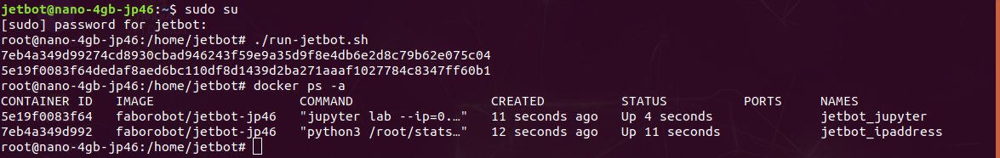
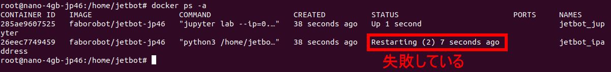

# Dockerが起動しない

Dockerコンテナが起動していることを確認します。

```
docker ps -a
```




## 起動に失敗したとき

もしここでうまく起動していないようであれば、dockerコンテナを停止して削除し、新しいDockerを起動してください。  



```
cd ~/docker
sudo su
docker stop jetbot_ipaddress jetbot_jupyter
docker rm jetbot_ipaddress jetbot_jupyter
./run-jetbot.sh
```


