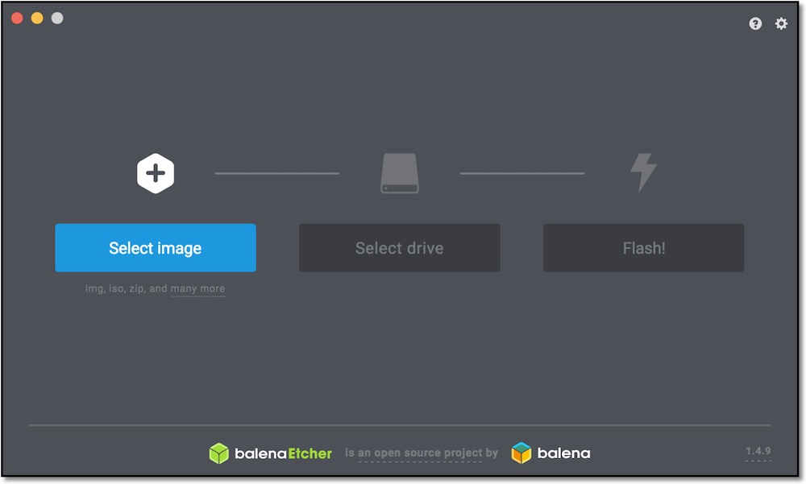
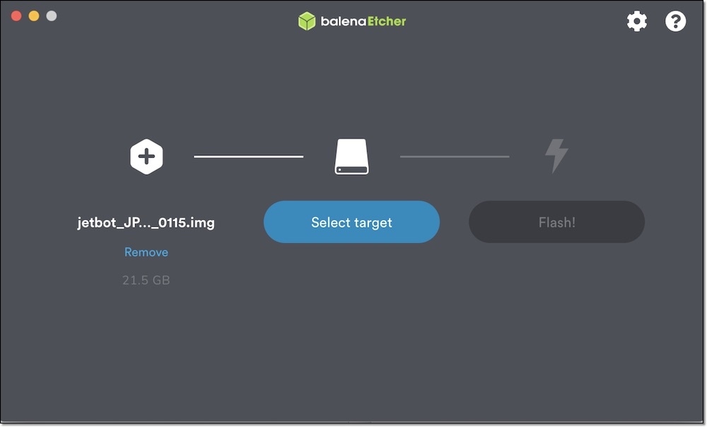
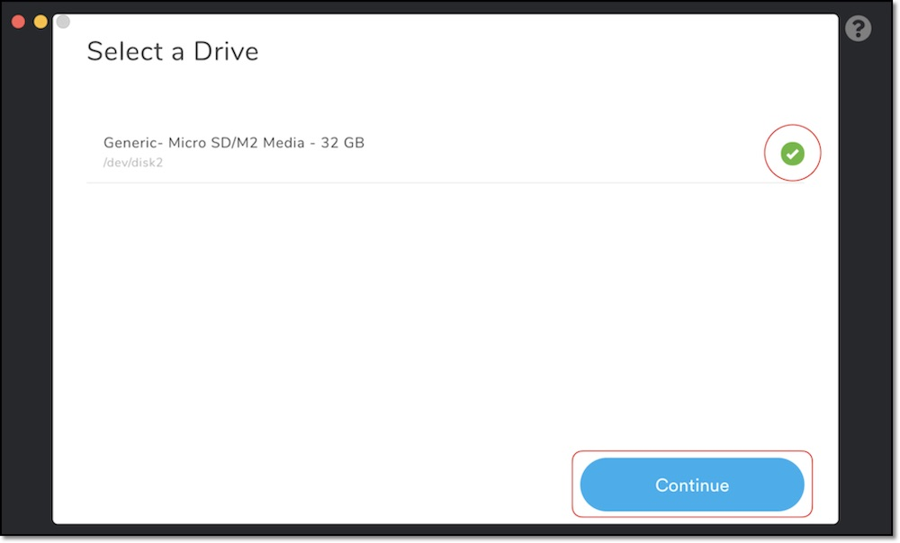

# SDカードの作成

## 自分でSDカードイメージを作成する場合
JetBot公式ドキュメントの[software_setup](https://jetbot.org/master/software_setup/sd_card.html)のページが参考になります。

【作業の流れ】

*   JetBot公式イメージをSDカードに書き込む
*   WiFiに接続する
*   FaBoのノートブックを設定する

## JetBot公式イメージをSDカードに書き込む

JetBot公式SDカードイメージは、[Etcher](https://www.balena.io/etcher/)を用いてSDカードに書き込みます。








## JetBotの起動

SDカードをJetson Nanoに差し込み起動します。

本SDカードのidとpassは下記の通りです。ログイン時に使用します。

|項目|内容|
|:--|:--|
|ID|jetbot|
|Pass|jetbot|

## WiFiに接続する
WiFi設定は「03.Setting(Nano)」の「3.JetBotのWiFiネットワーク設定」を参照してください。

## FaBoのノートブックを設定する
次にFaBoでforkしているJetBotのノートブックを利用方法について説明します。

### JetPack 4.4.1 Docker版
【更新の概要】

*   (前提) NVIDIA公式JetBotイメージがインストール済みであること
*   FaBoのノートブックをhostに用意する

【作業の流れ】

*   sshコマンドでJetson Nanoにリモートログイン
*   git cloneのためのディレクトリ作成
*   FaBoでforkしているJetBotをgit cloneする
*   作業用にノートブックをコピー

PCからJetBotにsshでリモートログイン
```
ssh jetbot@192.168.xxx.xxx
```
> パスワード：jetbot

Jetsonのコンソールで以下を実行
```
mkdir ~/github
cd ~/github
git clone https://github.com/FaBoPlatform/jetbot
cp -r ~/github/jetbot/notebooks ~/Notebooks
```
以上です。すでにjupyterにアクセスしている場合はブラウザをリロードすると`/home/jetbot/Notebooks`が出来ているので、このノートブックを利用します。

再度ノートブックを更新する場合は、ディレクトリを削除してやり直してください。
