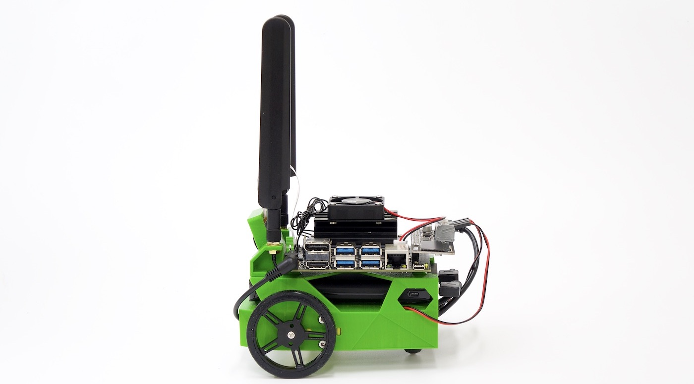

# JetBot Docs

FaBo JetBot Kit

## JetBot Docsについて

JetBot Docsは、FaBo JetBotの学習用ドキュメントです。

## サポート Discord

[https://discord.gg/StJ84Hb](https://discord.gg/StJ84Hb)

## 修正依頼等

GithubのRepoに[Issues](https://github.com/FaBoPlatform/JetbotDocs/issues)をあげる。

## 本ドキュメントでのセミナーの実施

- 2019年6月8日 DLLAB 2 周年イベント JetBotハンズオン(30台)
- 2019年上期 宇都宮大学・茨城大学大学院授業(20台)
- 2019年7月 JetBotハンズオン（柏の葉: 10台)
- 2019年10月10日 JetBotハンズオン (20台)
- 2019年11月14日 JetBotハンズオン 福島県立平工業高校向け (8台)
- 2020年1月10日 JetBotハンズオン (20台)
- 2020年1月16日 JetBotハンズオン (20台)

## JetBot Kitの購入先(FaBo Store)

- [FaBo JetBot Kit](https://fabo.store/collections/jetbot/products/jetbot-kit)

## 関連記事

- [宇都宮大学、世界に先駆けて JetBotをベースとしたAIロボットカーを学習教材に導入、自律動作マシン技術の習得を目指す](https://blogs.nvidia.co.jp/2019/07/23/jetbot-casestudies-utsunomiya-u/)
- [「NVIDIA Jetson Nano」を組込みAI学習用の教材として活用へ　宇都宮大学がNVIDIAやFaBoと開発、授業への実践導入は世界初](https://robotstart.info/2019/05/29/utsunomiya-u-jetson.html)
- [ 世界初のJetBotハンズオン・ワークショップ開催！Jetson Nano、Microsoft Azure、キット製品でAI自律ロボットカーの作成体験](https://robotstart.info/2019/06/08/jetbot-workshop-dllab.html)

## FaBo AI 教材
- [JetRacer Docs](https://faboplatform.github.io/JetracerDocs/)
- [JetBot Docs](https://faboplatform.github.io/JetbotDocs/)
- [DonkeyCar Docs](https://faboplatform.github.io/DonkeyDocs/)
- [EdgeAI Docs](https://faboplatform.github.io/EdgeAIDocs/)

## その他のドキュメント
- [Android Things Docs](https://faboplatform.github.io/AndroidThingsDocs/)
- [Denbun Docs](https://faboplatform.github.io/DenbunDocs/)
- [Circuit Docs](https://faboplatform.github.io/CircuitDocs/)
- [Swift Docs](https://faboplatform.github.io/SwiftDocs/)
- [NRF Docs](https://faboplatform.github.io/NRFDocs/)
